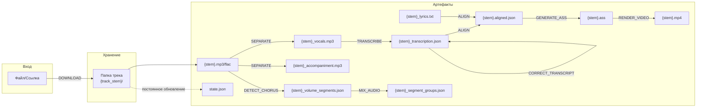
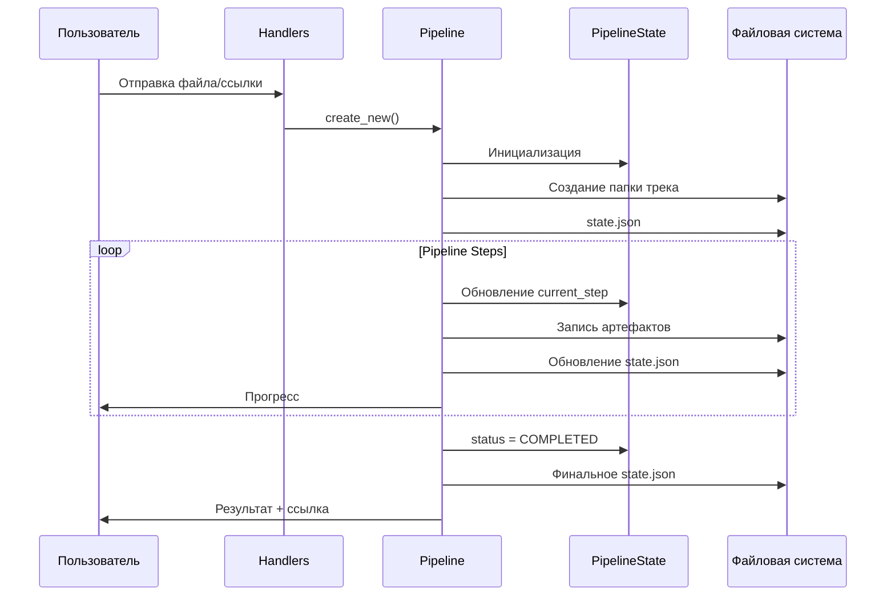

# Поток данных

## Общая схема



## Структура папки трека

После полного прохождения пайплайна папка трека содержит:

```
{TRACKS_ROOT_DIR}/{track_stem}/
├── state.json                          # Состояние пайплайна
│
├── {stem}.mp3                          # Исходный трек (или .flac)
├── {stem}_lyrics.txt                   # Текст песни
│
├── {stem}_vocals.mp3                   # Вокальная дорожка (Demucs)
├── {stem}_accompaniment.mp3            # Инструментальная дорожка (Demucs)
│
├── {stem}_transcription.json           # Транскрипция (speeches.ai)
├── {stem}_transcription_corrected.json # Скорректированная транскрипция (LLM)
│
├── {stem}_volume_segments.json         # Сегменты (ChorusDetector)
├── {stem}_segment_groups.json          # Группы сегментов
├── {stem}_metrics.json                 # Детальные метрики (1с)
│
├── {stem}_backvocal_mix.mp3            # Микс с бэк-вокалом
├── {stem}_supressedvocal_mix.mp3       # Микс с фикс. громкостью
│
├── {stem}.aligned.json                 # Выровненный текст
├── {stem}.ass                          # Субтитры ASS
├── {stem}.mp4                          # Финальное видео
└── {stem}_timeline.png                 # Визуализация (опционально)
```

## Поток данных по шагам

| Шаг | Входные данные | Выходные данные | Поле в PipelineState |
|-----|----------------|-----------------|---------------------|
| **DOWNLOAD** | URL, file_id, путь | Исходный аудиофайл | `track_source` |
| **ASK_LANGUAGE** | — | Выбор языка пользователем | `lang` |
| **GET_LYRICS** | Метаданные трека | Текст песни | `source_lyrics_file` |
| **SEPARATE** | `track_source` | Вокал + инструментал | `vocal_file`, `instrumental_file` |
| **TRANSCRIBE** | `vocal_file` | JSON транскрипции | `transcribe_json_file` |
| **GENERATE_LYRICS** | `transcribe_json_file` | Временный текст | `temp_lyrics_file` |
| **DETECT_CHORUS** | `vocal_file`, `track_source` | Сегменты, метрики | `volume_segments_file`, `detailed_metrics_file` |
| **CORRECT_TRANSCRIPT** | `transcribe_json_file`, `source_lyrics_file` | Скорректированная транскрипция | `corrected_transcribe_json_file` |
| **ALIGN** | `source_lyrics_file`, транскрипция | Выровненные таймкоды | `aligned_lyrics_file` |
| **MIX_AUDIO** | `vocal_file`, `instrumental_file`, сегменты | Обработанные миксы | `backvocal_mix_file`, `supressedvocal_mix`, `segment_groups_file` |
| **GENERATE_ASS** | `aligned_lyrics_file`, `segment_groups_file` | Файл субтитров | `ass_file` |
| **RENDER_VIDEO** | `ass_file`, аудиодорожки | MP4 видео | `output_file`, `download_url` |
| **SEND_VIDEO** | `output_file` | Отправка в Telegram | — |

## Форматы файлов

### state.json

```json
{
  "track_id": "abc123...",
  "user_id": 123456789,
  "current_step": "RENDER_VIDEO",
  "status": "COMPLETED",
  "error_message": null,
  "source_type": "telegram_file",
  "track_stem": "Artist - Song",
  "track_source": "/tracks/Artist - Song/Artist - Song.mp3",
  "vocal_file": "/tracks/Artist - Song/Artist - Song_vocals.mp3",
  "instrumental_file": "/tracks/Artist - Song/Artist - Song_accompaniment.mp3",
  "transcribe_json_file": "/tracks/Artist - Song/Artist - Song_transcription.json",
  "source_lyrics_file": "/tracks/Artist - Song/Artist - Song_lyrics.txt",
  "aligned_lyrics_file": "/tracks/Artist - Song/Artist - Song.aligned.json",
  "ass_file": "/tracks/Artist - Song/Artist - Song.ass",
  "output_file": "/tracks/Artist - Song/Artist - Song.mp4",
  "download_url": "https://example.com/music?getfile=Artist%20-%20Song/Artist%20-%20Song.mp4"
}
```

### {stem}_transcription.json

```json
{
  "duration": 234.5,
  "language": "ru",
  "segments": [
    {
      "id": 0,
      "start": 0.5,
      "end": 5.2,
      "text": "Первая строка текста"
    }
  ],
  "words": [
    {
      "start": 0.5,
      "end": 1.2,
      "word": "Первая"
    }
  ]
}
```

### {stem}_volume_segments.json

```json
[
  {
    "start": 0.0,
    "end": 15.5,
    "segment_type": "intro",
    "volume": 0.1,
    "scores": [
      {
        "start": 0.0,
        "end": 5.0,
        "vocal_energy": 0.02,
        "chroma_variance": 0.15,
        "sim_score": 0.8
      }
    ]
  }
]
```

### {stem}.aligned.json

```json
{
  "lines": [
    {
      "text": "Первая строка",
      "start": 0.5,
      "end": 5.2,
      "words": [
        {"text": "Первая", "start": 0.5, "end": 1.2},
        {"text": "строка", "start": 1.5, "end": 2.5}
      ]
    }
  ]
}
```

## Диаграмма потока



## Персистирование состояния

Состояние пайплайна сохраняется в `state.json` после каждого значимого изменения:

1. **Создание** — при инициализации пайплайна
2. **Обновление шага** — при переходе к следующему шагу
3. **Сохранение артефакта** — после успешного выполнения шага
4. **Ошибка** — при исключении (сохраняется `error_message`)
5. **Завершение** — финальный статус COMPLETED

Это позволяет:
- Продолжить обработку после сбоя
- Перезапустить с конкретного шага
- Отслеживать прогресс
- Диагностировать ошибки
