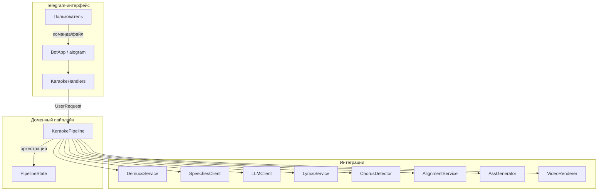

# Архитектура проекта

## Обзор

Караоке-бот — это асинхронное Python-приложение, которое преобразует музыкальные треки в караоке-видео с субтитрами и переключаемыми аудиодорожками.

## Высокоуровневая схема



## Три слоя архитектуры

### 1. Слой Telegram-интерфейса

| Компонент | Файл | Назначение |
|-----------|------|------------|
| [`BotApp`](app/bot_app.py) | `app/bot_app.py` | Инициализация бота, регистрация хендлеров, запуск polling |
| [`KaraokeHandlers`](app/handlers_karaoke.py) | `app/handlers_karaoke.py` | Обработка команд и сообщений, FSM-состояния |

### 2. Слой доменного пайплайна

| Компонент | Файл | Назначение |
|-----------|------|------------|
| [`KaraokePipeline`](app/pipeline.py) | `app/pipeline.py` | Оркестрация шагов обработки, управление состоянием |
| [`PipelineState`](app/models.py) | `app/models.py` | Состояние пайплайна, персистирование в JSON |

### 3. Слой интеграций

| Компонент | Файл | Назначение |
|-----------|------|------------|
| [`DemucsService`](app/demucs_service.py) | `app/demucs_service.py` | Разделение голоса и музыки |
| [`SpeechesClient`](app/speeches_client.py) | `app/speeches_client.py` | Транскрибация через speeches.ai |
| [`LLMClient`](app/llm_client.py) | `app/llm_client.py` | Работа с LLM через OpenRouter |
| [`LyricsService`](app/lyrics_service.py) | `app/lyrics_service.py` | Поиск текстов песен |
| [`ChorusDetector`](app/chorus_detector.py) | `app/chorus_detector.py` | Детектирование припевов и сегментов |
| [`AlignmentService`](app/alignment_service.py) | `app/alignment_service.py` | Выравнивание текста по таймкодам |
| [`AssGenerator`](app/ass_generator.py) | `app/ass_generator.py` | Генерация субтитров ASS |
| [`VideoRenderer`](app/video_renderer.py) | `app/video_renderer.py` | Рендеринг финального MP4 |
| [`VocalProcessor`](app/vocal_processor.py) | `app/vocal_processor.py` | Обработка вокала (бэк-вокал) |
| [`TrackVisualizer`](app/track_visualizer.py) | `app/track_visualizer.py` | Визуализация сегментов |

## Технологический стек

| Категория | Технология | Версия | Назначение |
|-----------|-----------|--------|------------|
| **Язык** | Python | 3.12 | Основной язык разработки |
| **Управление зависимостями** | `uv` | latest | Быстрая установка пакетов |
| **Telegram Bot** | `aiogram` | 3.x | Работа с Bot API |
| **ML/Audio** | `demucs` | 4.x | Разделение дорожек |
| **Audio Analysis** | `librosa` | latest | Анализ аудио, детектирование |
| **HTTP** | `httpx` | latest | Асинхронные HTTP-запросы |
| **Validation** | `pydantic` | 2.x | Модели данных, конфигурация |
| **Transcription** | `speeches.ai` | API | Whisper-транскрибация |
| **LLM** | OpenRouter | API | Корректировка транскрипции |
| **Video** | `ffmpeg` | 6.1+ | Рендеринг видео |
| **Visualization** | `matplotlib` | latest | PNG timeline визуализации |

## Структура проекта

```
x:/rabdalov/db_scripts/rabdalov/agent-test/agent-test/
├── app/                          # Основной код приложения
│   ├── __init__.py
│   ├── main.py                   # Точка входа
│   ├── bot_app.py               # Инициализация aiogram
│   ├── handlers_karaoke.py      # Обработчики команд
│   ├── pipeline.py              # Доменный пайплайн
│   ├── models.py                # Модели данных
│   ├── config.py                # Конфигурация (Settings)
│   ├── config_watcher.py        # Горячая перезагрузка .env
│   ├── demucs_service.py        # Разделение дорожек
│   ├── speeches_client.py       # Транскрибация
│   ├── llm_client.py            # LLM интеграция
│   ├── lyrics_service.py        # Поиск текстов
│   ├── chorus_detector.py       # Детектирование припевов
│   ├── vocal_processor.py       # Обработка вокала
│   ├── alignment_service.py     # Выравнивание текста
│   ├── ass_generator.py         # Генерация субтитров
│   ├── video_renderer.py        # Рендеринг видео
│   ├── track_visualizer.py      # Визуализация трека
│   ├── correct_transcript_service.py  # Корректировка транскрипции
│   ├── segment_change_service.py      # Изменение сегментов
│   ├── yandex_music_downloader.py     # Загрузка с Яндекс Музыки
│   ├── youtube_downloader.py          # Загрузка с YouTube
│   └── utils.py                 # Утилиты
├── docs/                         # Документация
│   ├── architecture/            # Архитектурная документация
│   ├── configuration/           # Справочник конфигурации
│   ├── ADR-*.md                 # Архитектурные решения
│   └── vision.md                # Техническое видение
├── plans/                        # Планы итераций
├── scripts/                      # Вспомогательные скрипты
├── pyproject.toml               # Зависимости проекта
├── Dockerfile                   # Docker образ
├── docker-compose.yaml          # Docker Compose
├── example.env                  # Пример конфигурации
└── README.md
```

## Основные принципы

### KISS (Keep It Simple, Stupid)
- Минимум абстракций
- Прямолинейный поток данных
- Нет сложных архитектурных паттернов без необходимости

### 1 класс = 1 файл
- Каждый значимый компонент в отдельном файле
- Вспомогательные функции только к своему классу
- Избегаем "бог-модулей"

### Асинхронность по умолчанию
- Все I/O операции через `async/await`
- Блокирующие задачи (demucs, ffmpeg) в executor'ах
- Неблокирующая обработка Telegram-апдейтов

### Конфигурация через окружение
- Все переменные среды в `.env`
- Горячая перезагрузка без рестарта
- Нет хардкода в коде

## Связанные документы

- [Компоненты системы](./components.md) — детальное описание каждого компонента
- [Поток данных](./data-flow.md) — как данные движутся через систему
- [Поток сообщений](./message-flow.md) — диаграммы взаимодействия с ботом
- [Пайплайн](./pipeline.md) — детали шагов обработки
- [Модели данных](./models.md) — структуры данных
- [Конфигурация](../configuration/index.md) — настройка системы
