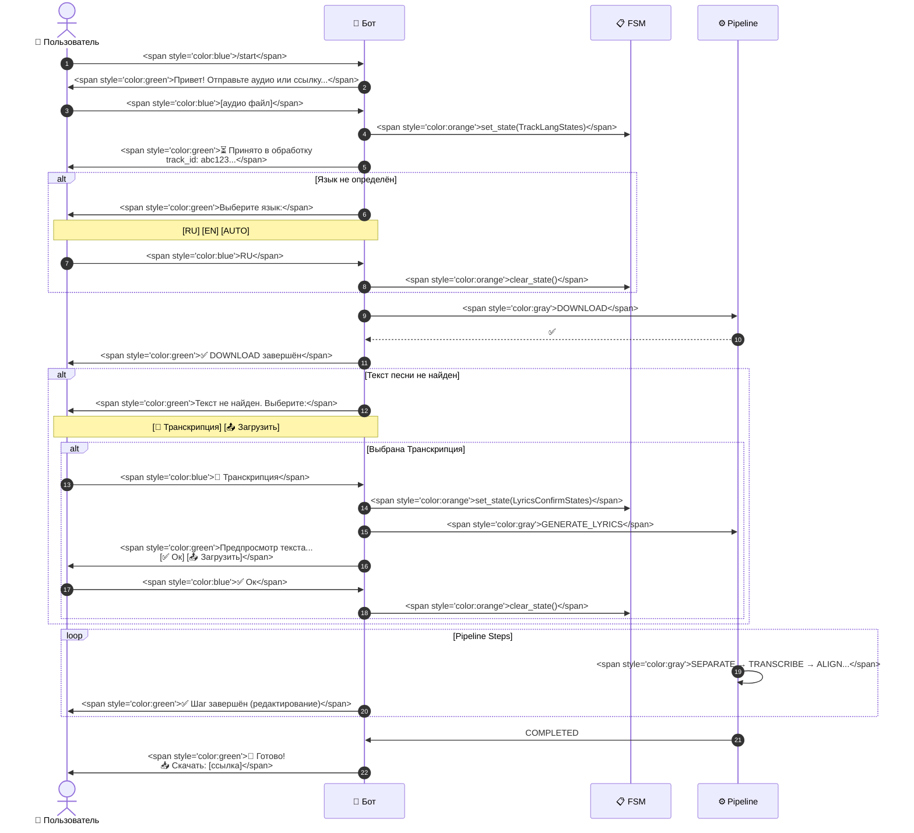
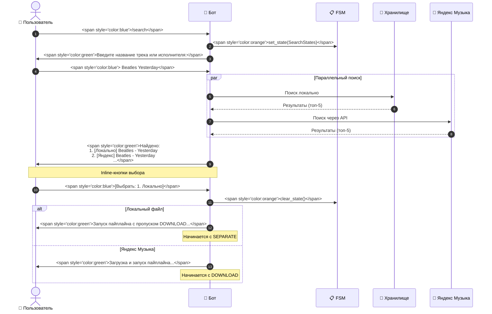
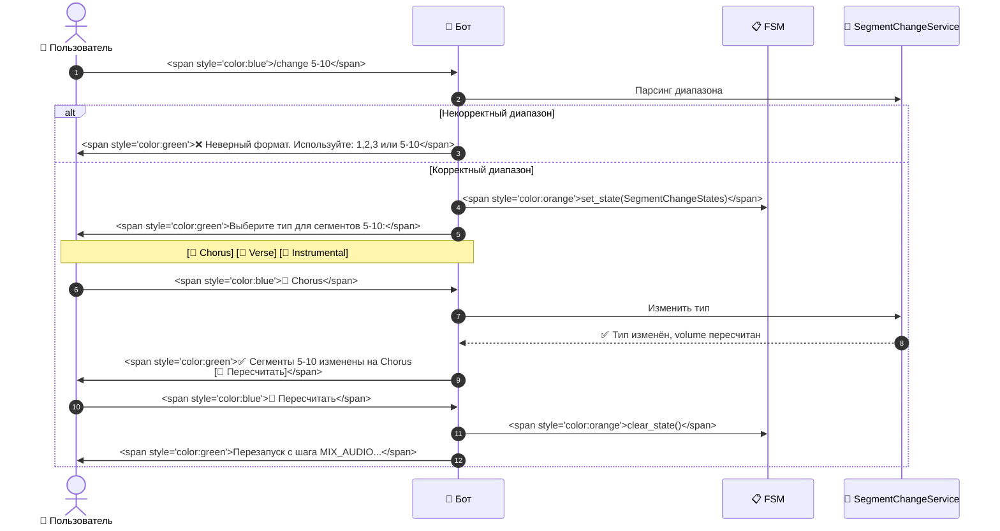
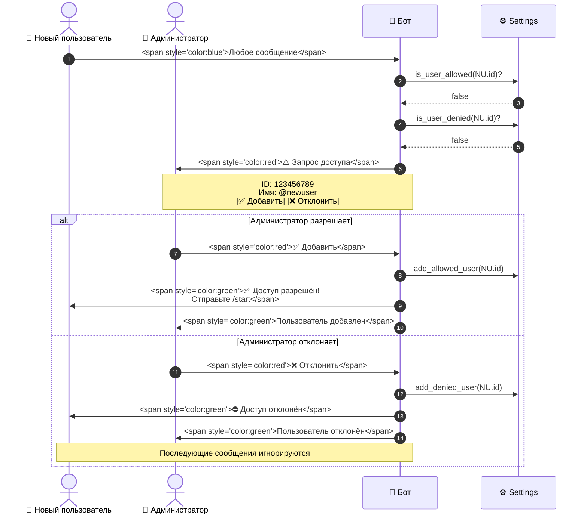
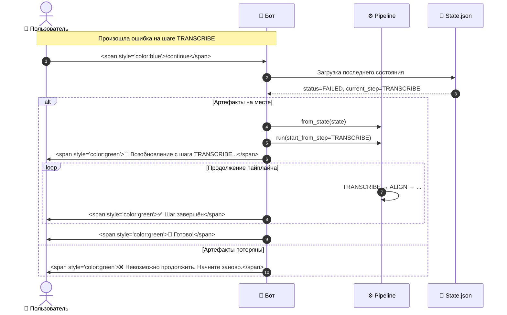
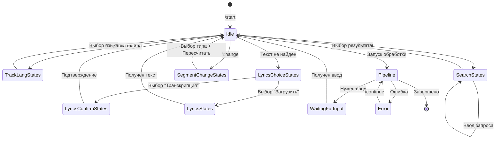

# Поток сообщений

Документация диаграмм взаимодействия пользователя с ботом через Telegram.

## Цветовое кодирование

- **Синий** — команды пользователя
- **Зелёный** — ответы бота
- **Оранжевый** — FSM переходы
- **Красный** — Admin действия
- **Серый** — Pipeline шаги

---

## 1. Базовый сценарий обработки трека



---

## 2. Сценарий поиска трека (/search)



---

## 3. Сценарий изменения сегментов (/change)



---

## 4. Сценарий управления доступом (Admin Flow)



---

## 5. Сценарий продолжения после ошибки (/continue)



---

## 6. FSM-состояния и переходы

### Таблица FSM States

| StatesGroup | Состояние | Триггер перехода | Следующее состояние |
|-------------|-----------|------------------|---------------------|
| `TrackLangStates` | `waiting_for_lang` | Отправка файла/ссылки без языка | clear_state() |
| `LyricsStates` | `waiting_for_lyrics` | Текст не найден, запрос ручного ввода | clear_state() |
| `LyricsChoiceStates` | `waiting_for_choice` | Текст не найден, выбор источника | → LyricsConfirmStates или clear_state() |
| `LyricsConfirmStates` | `waiting_for_confirmation` | Генерация текста из транскрипции | clear_state() |
| `SearchStates` | `waiting_for_query` | Команда /search | → waiting_for_selection |
| `SearchStates` | `waiting_for_selection` | Получены результаты поиска | clear_state() |
| `SegmentChangeStates` | `waiting_for_type_selection` | Команда /change | clear_state() |

### Диаграмма переходов FSM



---

## Реализация в коде

### Инициализация FSM

```python
# app/bot_app.py
from aiogram.fsm.storage.memory import MemoryStorage

dp = Dispatcher(storage=MemoryStorage())
```

### Определение состояний

```python
# app/models.py
from aiogram.fsm.state import State, StatesGroup

class TrackLangStates(StatesGroup):
    waiting_for_lang = State()

class LyricsStates(StatesGroup):
    waiting_for_lyrics = State()

class LyricsChoiceStates(StatesGroup):
    waiting_for_choice = State()

class LyricsConfirmStates(StatesGroup):
    waiting_for_confirmation = State()

class SearchStates(StatesGroup):
    waiting_for_query = State()
    waiting_for_selection = State()

class SegmentChangeStates(StatesGroup):
    waiting_for_type_selection = State()
```

### Использование в хендлерах

```python
# app/handlers_karaoke.py
from aiogram.fsm.context import FSMContext

@router.message(Command("search"))
async def cmd_search(message: Message, state: FSMContext):
    await state.set_state(SearchStates.waiting_for_query)
    await message.answer("Введите название трека:")

@router.message(SearchStates.waiting_for_query)
async def process_search_query(message: Message, state: FSMContext):
    # Обработка запроса
    await state.set_state(SearchStates.waiting_for_selection)
    # Показ результатов с inline-кнопками

@router.callback_query(SearchStates.waiting_for_selection, F.data.startswith("search:"))
async def process_search_selection(callback: CallbackQuery, state: FSMContext):
    # Обработка выбора
    await state.clear()
    # Запуск пайплайна
```

---

## Cross-references

- Реализация FSM: [`app/handlers_karaoke.py`](app/handlers_karaoke.py)
- Определение состояний: [`app/models.py`](app/models.py)
- Обработка команд: [`KaraokeHandlers`](app/handlers_karaoke.py)
- Список всех команд: [`docs/bot_commands.md`](docs/bot_commands.md)
