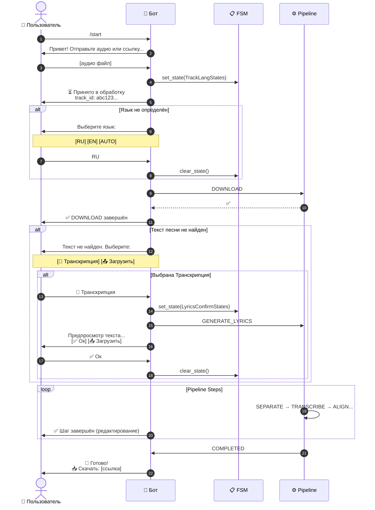
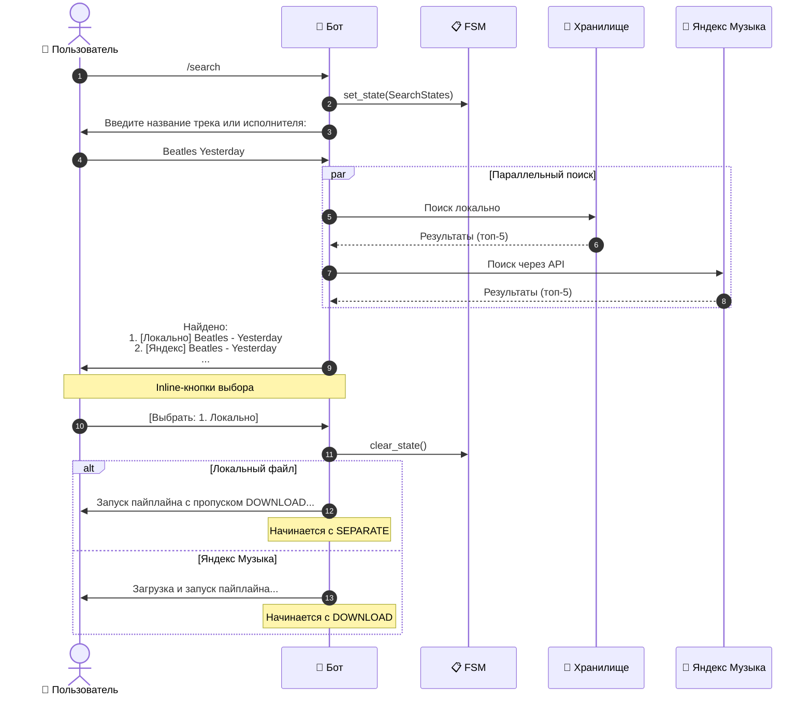
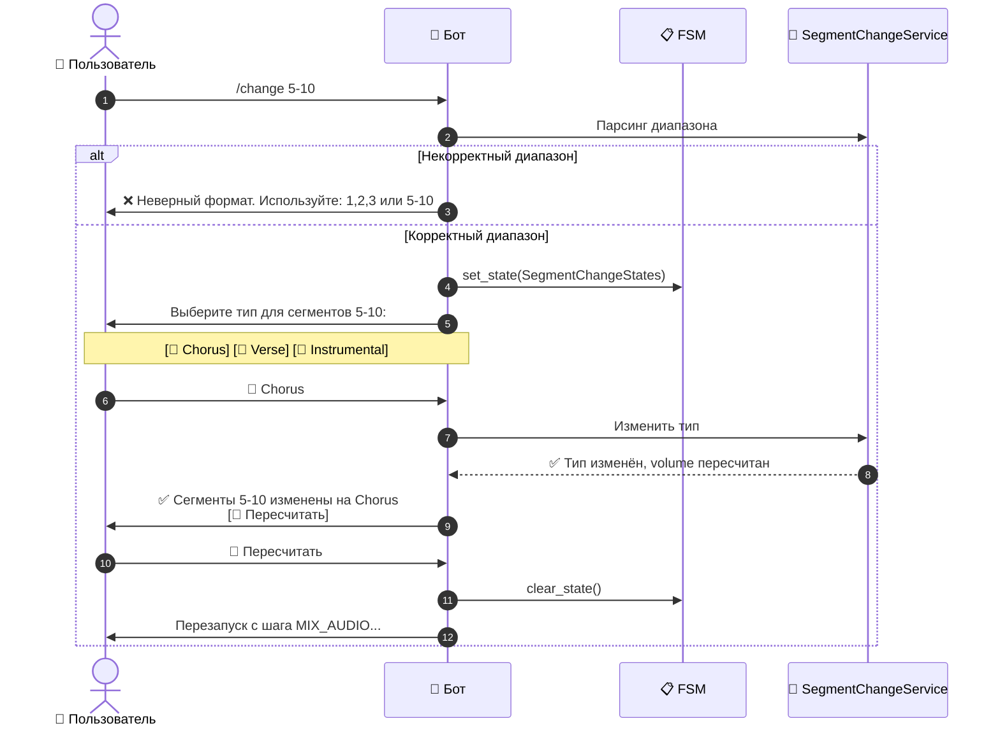
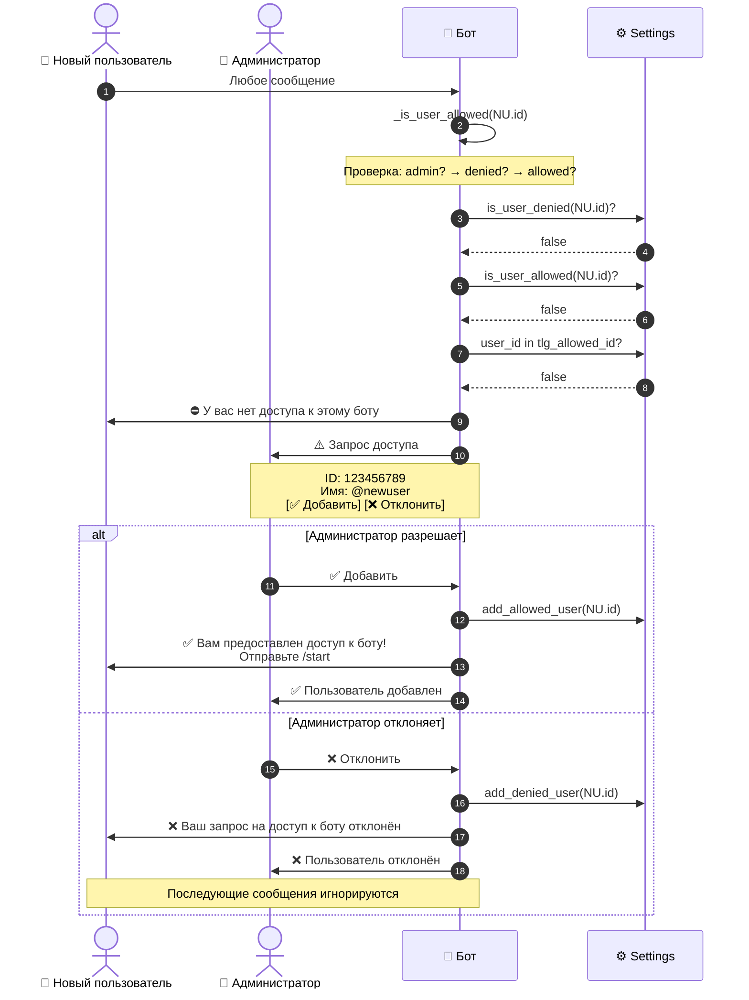
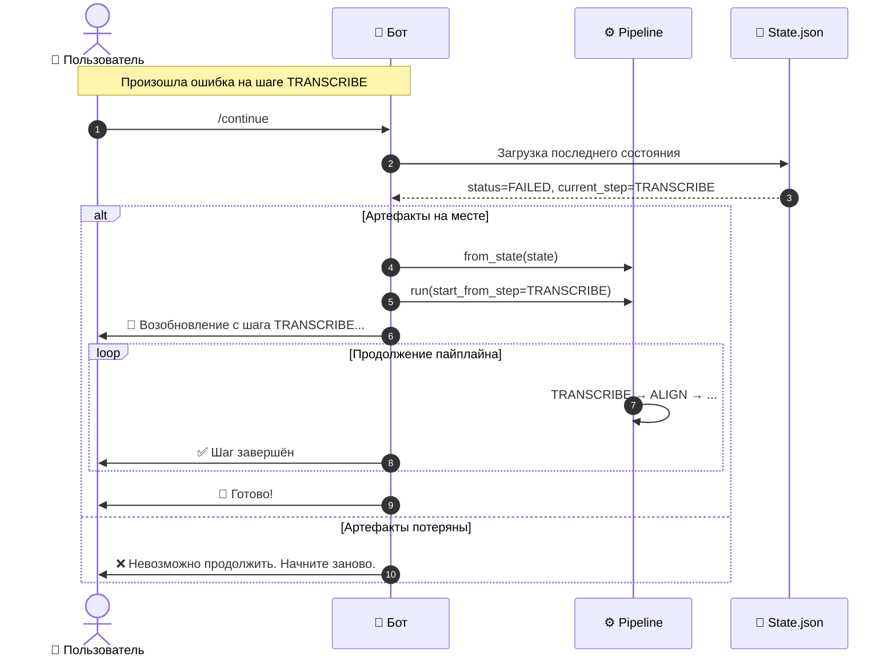
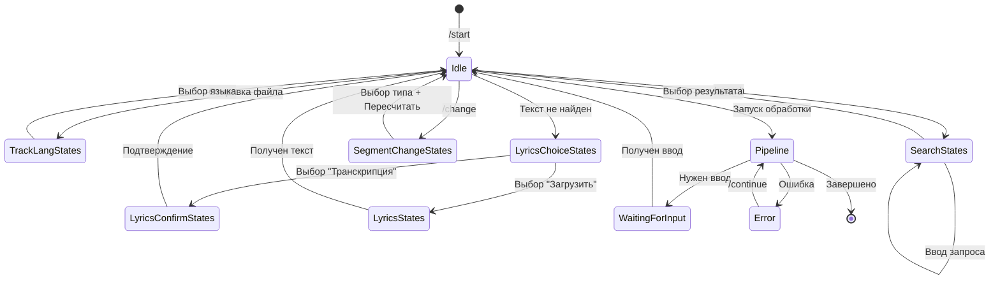

# Поток сообщений

Документация диаграмм взаимодействия пользователя с ботом через Telegram.

---

## 1. Базовый сценарий обработки трека



---

## 2. Сценарий поиска трека (/search)



---

## 3. Сценарий изменения сегментов (/change)



---

## 4. Сценарий управления доступом (Admin Flow)

### Алгоритм проверки доступа

Доступ разрешён, если выполняется **любое** из условий:
1. Пользователь является администратором (`user_id == ADMIN_ID`)
2. Пользователь явно добавлен в список разрешённых (`allowed_users`)
3. Пользователь есть в списке `TLG_ALLOWED_ID`

Доступ **отклонён** (без уведомления администратора), если:
- Пользователь в списке `denied_users`

Новые пользователи **не имеют доступа по умолчанию** — если списки пусты, доступ запрещён.



### Реализация в коде

**Проверка доступа для сообщений:**
```python
# app/handlers_karaoke.py

def _is_user_allowed(self, message: types.Message) -> bool:
    """Return True if the sender's user_id is in the allowed list."""
    user_id = message.from_user.id if message.from_user else None
    if user_id is None:
        return False
    # Admin always has access
    if user_id == self._settings.admin_id:
        return True
    if self._settings.is_user_denied(user_id):
        return False
    if self._settings.is_user_allowed(user_id):
        return True
    allowed = self._settings.tlg_allowed_id
    return user_id in allowed
```

**Проверка доступа для callback-запросов:**
```python
def _is_user_id_allowed(self, user_id: int | None) -> bool:
    """Return True if the user_id is allowed (for callback handlers)."""
    if user_id is None:
        return False
    # Admin always has access
    if user_id == self._settings.admin_id:
        return True
    if self._settings.is_user_denied(user_id):
        return False
    if self._settings.is_user_allowed(user_id):
        return True
    allowed = self._settings.tlg_allowed_id
    return user_id in allowed
```

**Обработка решения администратора:**
```python
async def _handle_admin_decision(
    self,
    callback: types.CallbackQuery,
    decision: str,
    user_id: int,
    user_name: str | None
) -> None:
    """Handle admin's decision to allow or deny a user."""
    if decision == "allow":
        self._settings.add_allowed_user(user_id, user_name)
        await callback.answer(f"✅ Пользователь {user_id} добавлен")
        # Уведомляем пользователя
        await callback.bot.send_message(
            chat_id=user_id,
            text="✅ Вам предоставлен доступ к боту!\n\n"
                 "Отправьте /start для начала работы..."
        )
    else:
        self._settings.add_denied_user(user_id, user_name)
        await callback.answer(f"❌ Пользователь {user_id} отклонён")
        # Уведомляем пользователя
        await callback.bot.send_message(
            chat_id=user_id,
            text="❌ Ваш запрос на доступ к боту отклонён."
        )
```

---

## 5. Сценарий продолжения после ошибки (/continue)



---

## 6. FSM-состояния и переходы

### Таблица FSM States

| StatesGroup | Состояние | Триггер перехода | Следующее состояние |
|-------------|-----------|------------------|---------------------|
| `TrackLangStates` | `waiting_for_lang` | Отправка файла/ссылки без языка | clear_state() |
| `LyricsStates` | `waiting_for_lyrics` | Текст не найден, запрос ручного ввода | clear_state() |
| `LyricsChoiceStates` | `waiting_for_choice` | Текст не найден, выбор источника | → LyricsConfirmStates или clear_state() |
| `LyricsConfirmStates` | `waiting_for_confirmation` | Генерация текста из транскрипции | clear_state() |
| `SearchStates` | `waiting_for_query` | Команда /search | → waiting_for_selection |
| `SearchStates` | `waiting_for_selection` | Получены результаты поиска | clear_state() |
| `SegmentChangeStates` | `waiting_for_type_selection` | Команда /change | clear_state() |

### Диаграмма переходов FSM



---

## Реализация в коде

### Инициализация FSM

```python
# app/bot_app.py
from aiogram.fsm.storage.memory import MemoryStorage

dp = Dispatcher(storage=MemoryStorage())
```

### Определение состояний

```python
# app/models.py
from aiogram.fsm.state import State, StatesGroup

class TrackLangStates(StatesGroup):
    waiting_for_lang = State()

class LyricsStates(StatesGroup):
    waiting_for_lyrics = State()

class LyricsChoiceStates(StatesGroup):
    waiting_for_choice = State()

class LyricsConfirmStates(StatesGroup):
    waiting_for_confirmation = State()

class SearchStates(StatesGroup):
    waiting_for_query = State()
    waiting_for_selection = State()

class SegmentChangeStates(StatesGroup):
    waiting_for_type_selection = State()
```

### Использование в хендлерах

```python
# app/handlers_karaoke.py
from aiogram.fsm.context import FSMContext

@router.message(Command("search"))
async def cmd_search(message: Message, state: FSMContext):
    await state.set_state(SearchStates.waiting_for_query)
    await message.answer("Введите название трека:")

@router.message(SearchStates.waiting_for_query)
async def process_search_query(message: Message, state: FSMContext):
    # Обработка запроса
    await state.set_state(SearchStates.waiting_for_selection)
    # Показ результатов с inline-кнопками

@router.callback_query(SearchStates.waiting_for_selection, F.data.startswith("search:"))
async def process_search_selection(callback: CallbackQuery, state: FSMContext):
    # Обработка выбора
    await state.clear()
    # Запуск пайплайна
```

---

## Cross-references

- Реализация FSM: [`app/handlers_karaoke.py`](app/handlers_karaoke.py)
- Определение состояний: [`app/models.py`](app/models.py)
- Обработка команд: [`KaraokeHandlers`](app/handlers_karaoke.py)
- Список всех команд: [`docs/bot_commands.md`](docs/bot_commands.md)
