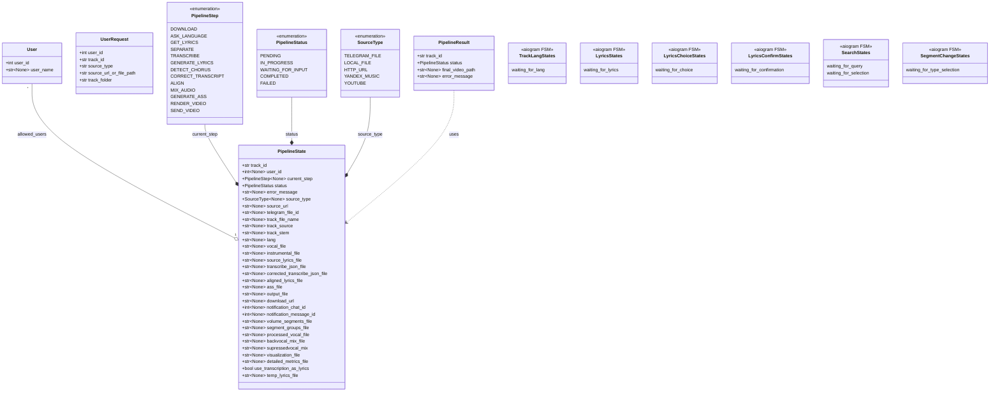

# Модели данных

## Диаграмма классов



---

## User

Пользователь системы.

```python
class User(BaseModel):
    user_id: int
    user_name: str | None = None
```

**Поля:**

| Поле | Тип | Описание |
|------|-----|----------|
| `user_id` | `int` | Telegram ID пользователя |
| `user_name` | `str \| None` | Имя пользователя (username) |

**Использование:**
- Хранение в `Settings.allowed_users` и `Settings.denied_users`
- Сериализация в `users.json`

---

## UserRequest

Запрос на обработку трека от пользователя.

```python
class UserRequest(BaseModel):
    user_id: int
    track_id: str
    source_type: str  # "file" | "url"
    source_url_or_file_path: str
    track_folder: str
```

**Поля:**

| Поле | Тип | Описание |
|------|-----|----------|
| `user_id` | `int` | ID пользователя |
| `track_id` | `str` | UUID трека |
| `source_type` | `str` | Тип источника ("file" или "url") |
| `source_url_or_file_path` | `str` | URL или путь к файлу |
| `track_folder` | `str` | Путь к папке трека |

---

## SourceType

Тип источника трека для шага DOWNLOAD.

```python
class SourceType(str, Enum):
    TELEGRAM_FILE = "telegram_file"
    LOCAL_FILE = "local_file"
    HTTP_URL = "http_url"
    YANDEX_MUSIC = "yandex_music"
    YOUTUBE = "youtube"
```

| Значение | Описание |
|----------|----------|
| `TELEGRAM_FILE` | Файл, загруженный через Telegram |
| `LOCAL_FILE` | Локальный файл (из поиска или ФС) |
| `HTTP_URL` | Произвольный HTTP(S) URL |
| `YANDEX_MUSIC` | Ссылка на Яндекс Музыку |
| `YOUTUBE` | Ссылка на YouTube |

---

## PipelineStep

Перечисление шагов пайплайна.

```python
class PipelineStep(str, Enum):
    DOWNLOAD = "DOWNLOAD"
    ASK_LANGUAGE = "ASK_LANGUAGE"
    GET_LYRICS = "GET_LYRICS"
    SEPARATE = "SEPARATE"
    TRANSCRIBE = "TRANSCRIBE"
    GENERATE_LYRICS = "GENERATE_LYRICS"
    DETECT_CHORUS = "DETECT_CHORUS"
    CORRECT_TRANSCRIPT = "CORRECT_TRANSCRIPT"
    ALIGN = "ALIGN"
    MIX_AUDIO = "MIX_AUDIO"
    GENERATE_ASS = "GENERATE_ASS"
    RENDER_VIDEO = "RENDER_VIDEO"
    SEND_VIDEO = "SEND_VIDEO"
```

**Порядок выполнения:**
```python
_ORDERED_STEPS: list[PipelineStep] = [
    PipelineStep.DOWNLOAD,
    PipelineStep.ASK_LANGUAGE,
    PipelineStep.GET_LYRICS,
    PipelineStep.SEPARATE,
    PipelineStep.TRANSCRIBE,
    PipelineStep.GENERATE_LYRICS,
    PipelineStep.DETECT_CHORUS,
    PipelineStep.CORRECT_TRANSCRIPT,
    PipelineStep.ALIGN,
    PipelineStep.MIX_AUDIO,
    PipelineStep.GENERATE_ASS,
    PipelineStep.RENDER_VIDEO,
    PipelineStep.SEND_VIDEO,
]
```

---

## PipelineStatus

Статус выполнения пайплайна.

```python
class PipelineStatus(str, Enum):
    PENDING = "PENDING"
    IN_PROGRESS = "IN_PROGRESS"
    WAITING_FOR_INPUT = "WAITING_FOR_INPUT"
    COMPLETED = "COMPLETED"
    FAILED = "FAILED"
```

| Статус | Описание |
|--------|----------|
| `PENDING` | Ожидание запуска |
| `IN_PROGRESS` | Выполняется |
| `WAITING_FOR_INPUT` | Ожидание ввода пользователя |
| `COMPLETED` | Успешно завершён |
| `FAILED` | Завершён с ошибкой |

---

## PipelineState

Основная модель состояния пайплайна. Персистируется в `state.json`.

```python
class PipelineState(BaseModel):
    # Идентификация
    track_id: str
    user_id: int | None = None
    
    # Состояние выполнения
    current_step: PipelineStep | None = None
    status: PipelineStatus = PipelineStatus.PENDING
    error_message: str | None = None
    
    # Источник
    source_type: SourceType | None = None
    source_url: str | None = None
    telegram_file_id: str | None = None
    
    # Метаданные трека
    track_file_name: str | None = None
    track_source: str | None = None
    track_stem: str | None = None
    lang: str | None = None
    
    # Аудио дорожки (SEPARATE)
    vocal_file: str | None = None
    instrumental_file: str | None = None
    
    # Текст и транскрипция
    source_lyrics_file: str | None = None
    transcribe_json_file: str | None = None
    corrected_transcribe_json_file: str | None = None
    
    # Синхронизация (ALIGN)
    aligned_lyrics_file: str | None = None
    
    # Сегменты (DETECT_CHORUS, MIX_AUDIO)
    volume_segments_file: str | None = None
    segment_groups_file: str | None = None
    processed_vocal_file: str | None = None
    backvocal_mix_file: str | None = None
    supressedvocal_mix: str | None = None
    
    # Вывод (GENERATE_ASS, RENDER_VIDEO)
    ass_file: str | None = None
    output_file: str | None = None
    download_url: str | None = None
    visualization_file: str | None = None
    detailed_metrics_file: str | None = None
    
    # Уведомления
    notification_chat_id: int | None = None
    notification_message_id: int | None = None
    
    # Флаги
    use_transcription_as_lyrics: bool = False
    temp_lyrics_file: str | None = None
```

### Поля по категориям

#### Идентификация
| Поле | Описание |
|------|----------|
| `track_id` | UUID трека |
| `user_id` | Telegram ID пользователя |

#### Состояние выполнения
| Поле | Описание |
|------|----------|
| `current_step` | Текущий/последний выполняемый шаг |
| `status` | Статус выполнения |
| `error_message` | Сообщение об ошибке (при FAILED) |

#### Источник трека
| Поле | Описание |
|------|----------|
| `source_type` | Тип источника (TELEGRAM_FILE, YOUTUBE, ...) |
| `source_url` | URL или путь к исходному файлу |
| `telegram_file_id` | file_id для Telegram файлов |

#### Метаданные
| Поле | Описание |
|------|----------|
| `track_file_name` | Имя исходного файла |
| `track_source` | Полный путь к исходному файлу |
| `track_stem` | Базовое имя трека (используется для папки) |
| `lang` | Код языка (ru, en) |

#### Аудио дорожки (SEPARATE)
| Поле | Описание |
|------|----------|
| `vocal_file` | Путь к вокальной дорожке |
| `instrumental_file` | Путь к инструментальной дорожке |

#### Текст и транскрипция
| Поле | Описание |
|------|----------|
| `source_lyrics_file` | Путь к TXT с текстом песни |
| `transcribe_json_file` | Путь к JSON транскрипции |
| `corrected_transcribe_json_file` | Путь к скорректированной транскрипции |
| `aligned_lyrics_file` | Путь к JSON с выровненными таймкодами |

#### Сегменты (DETECT_CHORUS, MIX_AUDIO)
| Поле | Описание |
|------|----------|
| `volume_segments_file` | JSON с разметкой сегментов |
| `segment_groups_file` | JSON с группами сегментов |
| `processed_vocal_file` | Обработанная вокальная дорожка |
| `backvocal_mix_file` | Микс с эффектом бэк-вокала |
| `supressedvocal_mix` | Микс с фиксированной громкостью |
| `detailed_metrics_file` | JSON с детальными метриками |

#### Вывод (GENERATE_ASS, RENDER_VIDEO)
| Поле | Описание |
|------|----------|
| `ass_file` | Путь к файлу субтитров ASS |
| `output_file` | Путь к итоговому MP4 |
| `download_url` | URL для скачивания |
| `visualization_file` | PNG timeline визуализация |

#### Уведомления
| Поле | Описание |
|------|----------|
| `notification_chat_id` | ID чата для уведомлений |
| `notification_message_id` | ID сообщения для редактирования |

#### Флаги
| Поле | Описание |
|------|----------|
| `use_transcription_as_lyrics` | Использовать транскрипцию как текст |
| `temp_lyrics_file` | Временный файл сгенерированного текста |

---

## PipelineResult

Результат выполнения пайплайна.

```python
class PipelineResult(BaseModel):
    track_id: str
    status: PipelineStatus
    final_video_path: str | None = None
    error_message: str | None = None
```

**Поля:**

| Поле | Тип | Описание |
|------|-----|----------|
| `track_id` | `str` | UUID трека |
| `status` | `PipelineStatus` | Итоговый статус |
| `final_video_path` | `str \| None` | Путь к финальному видео (при успехе) |
| `error_message` | `str \| None` | Сообщение об ошибке (при неудаче) |

---

## FSM States

Состояния конечного автомата для диалогов.

### TrackLangStates
```python
class TrackLangStates(StatesGroup):
    waiting_for_lang = State()
```
Ожидание выбора языка трека.

### LyricsStates
```python
class LyricsStates(StatesGroup):
    waiting_for_lyrics = State()
```
Ожидание ручного ввода текста песни.

### LyricsChoiceStates
```python
class LyricsChoiceStates(StatesGroup):
    waiting_for_choice = State()
```
Ожидание выбора источника текста (транскрипция или загрузка).

### LyricsConfirmStates
```python
class LyricsConfirmStates(StatesGroup):
    waiting_for_confirmation = State()
```
Ожидание подтверждения текста, сгенерированного из транскрипции.

### SearchStates
```python
class SearchStates(StatesGroup):
    waiting_for_query = State()
    waiting_for_selection = State()
```
Ожидание запроса и выбора результата поиска.

### SegmentChangeStates
```python
class SegmentChangeStates(StatesGroup):
    waiting_for_type_selection = State()
```
Ожидание выбора типа сегмента при изменении через `/change`.

---

## Связь моделей с файлами

```
┌─────────────────┐
│  PipelineState  │
│  (Pydantic)     │
└────────┬────────┘
         │ model_dump_json()
         ▼
┌─────────────────┐
│   state.json    │
│  (JSON файл)    │
└─────────────────┘

┌─────────────────┐
│      User       │
│  (Pydantic)     │
└────────┬────────┘
         │ model_dump()
         ▼
┌─────────────────┐
│   users.json    │
│  (JSON файл)    │
└─────────────────┘
```

## Пример state.json

```json
{
  "track_id": "a1b2c3d4e5f6",
  "user_id": 123456789,
  "current_step": "RENDER_VIDEO",
  "status": "COMPLETED",
  "error_message": null,
  "source_type": "telegram_file",
  "source_url": "/tracks/Artist - Song/Artist - Song.mp3",
  "telegram_file_id": "BQACAgIAAxkBAA...",
  "track_file_name": "Artist - Song.mp3",
  "track_source": "/tracks/Artist - Song/Artist - Song.mp3",
  "track_stem": "Artist - Song",
  "lang": "ru",
  "vocal_file": "/tracks/Artist - Song/Artist - Song_vocals.mp3",
  "instrumental_file": "/tracks/Artist - Song/Artist - Song_accompaniment.mp3",
  "source_lyrics_file": "/tracks/Artist - Song/Artist - Song_lyrics.txt",
  "transcribe_json_file": "/tracks/Artist - Song/Artist - Song_transcription.json",
  "corrected_transcribe_json_file": "/tracks/Artist - Song/Artist - Song_transcription_corrected.json",
  "aligned_lyrics_file": "/tracks/Artist - Song/Artist - Song.aligned.json",
  "ass_file": "/tracks/Artist - Song/Artist - Song.ass",
  "output_file": "/tracks/Artist - Song/Artist - Song.mp4",
  "download_url": "https://example.com/music?getfile=Artist%20-%20Song/Artist%20-%20Song.mp4",
  "volume_segments_file": "/tracks/Artist - Song/Artist - Song_volume_segments.json",
  "segment_groups_file": "/tracks/Artist - Song/Artist - Song_segment_groups.json",
  "backvocal_mix_file": "/tracks/Artist - Song/Artist - Song_backvocal_mix.mp3",
  "supressedvocal_mix": "/tracks/Artist - Song/Artist - Song_supressedvocal_mix.mp3",
  "visualization_file": "/tracks/Artist - Song/Artist - Song_timeline.png",
  "detailed_metrics_file": "/tracks/Artist - Song/Artist - Song_metrics.json",
  "notification_chat_id": 123456789,
  "notification_message_id": 456,
  "use_transcription_as_lyrics": false,
  "temp_lyrics_file": null
}
```
