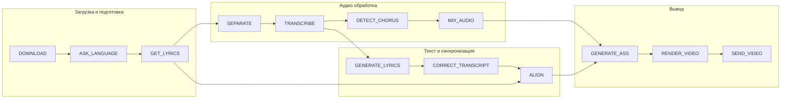
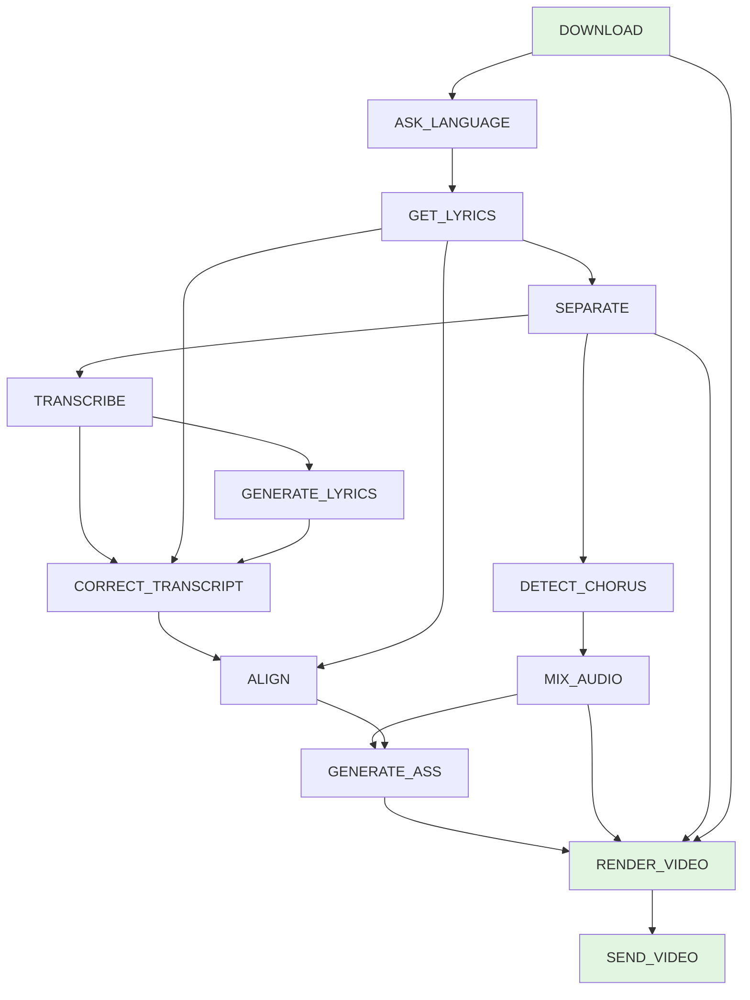

# Пайплайн обработки

## Общая схема



## Полный порядок шагов

```
┌─────────────────┬─────────────────────────────────────────┐
│ Шаг             │ Описание                                │
├─────────────────┼─────────────────────────────────────────┤
│ 1. DOWNLOAD     │ Загрузка трека из источника             │
│ 2. ASK_LANGUAGE │ Запрос языка у пользователя             │
│ 3. GET_LYRICS   │ Получение текста песни                  │
│ 4. SEPARATE     │ Demucs: разделение на дорожки           │
│ 5. TRANSCRIBE   │ Транскрибация через speeches.ai         │
│ 6. GENERATE_LYRICS│ Генерация текста из транскрипции      │
│ 7. DETECT_CHORUS│ Детектирование сегментов трека          │
│ 8. CORRECT_TRANSCRIPT│ Корректировка транскрипции (LLM)    │
│ 9. ALIGN        │ Выравнивание текста по таймкодам        │
│ 10. MIX_AUDIO   │ Микширование с эффектом бэк-вокала      │
│ 11. GENERATE_ASS│ Генерация субтитров ASS                 │
│ 12. RENDER_VIDEO│ Рендеринг MP4 через ffmpeg              │
│ 13. SEND_VIDEO  │ Отправка результата в Telegram          │
└─────────────────┴─────────────────────────────────────────┘
```

---

## 1. DOWNLOAD — Загрузка трека

### Описание
Унифицированная загрузка из любого источника.

### Поддерживаемые источники

| Тип | SourceType | Метод |
|-----|------------|-------|
| Telegram файл | `TELEGRAM_FILE` | `_download_telegram_file()` |
| Яндекс Музыка | `YANDEX_MUSIC` | `_download_yandex_music()` |
| YouTube | `YOUTUBE` | `_download_youtube()` |
| HTTP URL | `HTTP_URL` | `_download_http_url()` |
| Локальный файл | `LOCAL_FILE` | `_use_local_file()` |

### Вход
- `source_type` — тип источника
- `source_url` — URL или путь
- `telegram_file_id` — для Telegram файлов

### Выход
- `track_source` — путь к исходному файлу
- `track_file_name` — имя файла
- `track_stem` — базовое имя (используется для папки)

### Валидация
- Длительность > 60 секунд (проверка через ffprobe)
- Формат: MP3, FLAC, и др.

### Ошибки
- `RuntimeError` — ошибка скачивания
- `RuntimeError` — трек слишком короткий (< 60 сек)

---

## 2. ASK_LANGUAGE — Выбор языка

### Описание
Запрос языка песни у пользователя, если не определён автоматически.

### Условие выполнения
Пропускается, если `lang` уже установлен в `PipelineState`.

### Поведение
- Приостанавливает пайплайн (`WaitingForInputError`)
- Отправляет inline-кнопки: [RU] [EN] [AUTO]
- После выбора — возобновление через `pipeline.resume()`

### Выход
- `lang` — код языка (ru, en, auto)

---

## 3. GET_LYRICS — Получение текста песни

### Описание
Поиск текста песни через внешние сервисы или ручной ввод.

### Провайдеры
- **Genius API** — если `LYRICS_ENABLE_GENIUS=true` и `GENIUS_TOKEN` задан
- **LyricaV2** — если `LYRICS_ENABLE_LYRICA=true`
- **lyrics-lib** — если `LYRICS_ENABLE_LYRICSLIB=true`

### Условия пропуска
- Если `source_lyrics_file` уже существует и не пуст
- Если текст получен из Яндекс Музыки (в DOWNLOAD)

### Fallback
Если текст не найден автоматически:
1. Показывается выбор: [📝 Транскрипция] [📤 Загрузить]
2. При выборе "Транскрипция" — продолжение до шага GENERATE_LYRICS
3. При выборе "Загрузить" — ожидание текста от пользователя

### Выход
- `source_lyrics_file` — путь к TXT файлу с текстом

### Ошибки
- `LyricsNotFoundError` — текст не найден и не предоставлен

---

## 4. SEPARATE — Разделение дорожек

### Описание
Разделение аудио на вокал и инструментал через Demucs.

### Сервис
[`DemucsService`](app/demucs_service.py)

### Конфигурация
- `DEMUCS_MODEL` — модель (htdemucs, htdemucs_ft)
- `DEMUCS_OUTPUT_FORMAT` — mp3 или wav

### Вход
- `track_source` — исходный аудиофайл

### Выход
- `vocal_file` — вокальная дорожка
- `instrumental_file` — инструментальная дорожка

### Формат выхода
- MP3 320 kbps / 44100 Hz

---

## 5. TRANSCRIBE — Транскрибация

### Описание
Распознавание текста из вокальной дорожки через speeches.ai.

### Сервис
[`SpeechesClient`](app/speeches_client.py)

### Конфигурация
- `SPEECHES_BASE_URL` — URL сервиса
- `TRANSCRIPTION_MODEL_ID` — модель Whisper
- `SPEECHES_TIMEOUT` — таймаут (сек)

### Вход
- `vocal_file` — вокальная дорожка
- `lang` — язык (опционально)

### Выход
- `transcribe_json_file` — JSON с результатом

### Очистка результата
После транскрибации сохраняются только:
- `duration`, `language`
- `segments` (id, start, end, text)
- `words` (start, end, word)

---

## 6. GENERATE_LYRICS — Генерация текста из транскрипции

### Описание
Генерация текста песни из распознанной транскрипции.

### Условие выполнения
Только если `use_transcription_as_lyrics=true`

### Процесс
1. Извлечение текста из `transcribe_json_file`
2. Форматирование в строки
3. Сохранение во временный файл
4. Ожидание подтверждения пользователя

### Выход
- `temp_lyrics_file` — временный TXT файл

### Поведение
- Приостанавливает пайплайн (`WaitingForInputError`)
- Показывает предпросмотр с кнопками [✅ Ок] [📤 Загрузить]

---

## 7. DETECT_CHORUS — Детектирование сегментов

### Описание
Анализ структуры трека и определение сегментов (intro, verse, chorus, bridge, outro, instrumental).

### Сервис
[`ChorusDetector`](app/chorus_detector.py)

### Условие выполнения
Пропускается если `DETECT_CHORUS_ENABLED=false`

### Конфигурация
- `CHORUS_MIN_DURATION_SEC` — мин. длительность сегмента
- `CHORUS_VOCAL_SILENCE_THRESHOLD` — порог тишины для instrumental
- `CHORUS_BOUNDARY_MERGE_TOLERANCE_SEC` — допуск объединения границ

### Вход
- `vocal_file` — для анализа энергии вокала
- `track_source` — для анализа общей структуры

### Выход
- `volume_segments_file` — JSON с сегментами
- `detailed_metrics_file` — JSON с метриками (1 сек)

### Алгоритм
1. Извлечение признаков (chroma, MFCC, энергия, HPSS)
2. Построение self-similarity matrix
3. Определение границ сегментов (msaf)
4. Классификация по энергии вокала
5. Сохранение детальных метрик

---

## 8. CORRECT_TRANSCRIPT — Корректировка транскрипции

### Описание
Исправление ошибок распознавания с помощью LLM на основе текста песни.

### Сервис
[`CorrectTranscriptService`](app/correct_transcript_service.py)

### Условие выполнения
Пропускается если:
- `CORRECT_TRANSCRIPT_ENABLED=false`
- `OPENROUTER_API_KEY` не задан

### Вход
- `transcribe_json_file` — исходная транскрипция
- `source_lyrics_file` — текст песни (эталон)

### Выход
- `corrected_transcribe_json_file` — скорректированная транскрипция

### Поведение при ошибке
Продолжает выполнение пайплайна с оригинальной транскрипцией.

---

## 9. ALIGN — Выравнивание текста

### Описание
Сопоставление слов текста песни с таймкодами транскрипции.

### Сервис
[`AlignmentService`](app/alignment_service.py)

### Стратегии
1. **LrcDirectStrategy** — если транскрипция содержит LRC-совместимые таймкоды
2. **SequenceAlignmentStrategy** — алгоритм Нидлмана-Вунша

### Вход
- `source_lyrics_file` — текст песни
- `transcribe_json_file` или `corrected_transcribe_json_file` — транскрипция

### Выход
- `aligned_lyrics_file` — JSON с выровненными таймкодами

### Корректировка таймингов
- Если первое слово слишком долгое (> `MAX_WORD_TIME`):
  - Вставляется "(проигрыш)"
  - Время корректируется по `NORMAL_WORD_TIME`

---

## 10. MIX_AUDIO — Микширование аудио

### Описание
Обработка вокала с эффектом бэк-вокала и микширование.

### Сервис
[`VocalProcessor`](app/vocal_processor.py)

### Условие выполнения
Пропускается если `MIX_AUDIO_ENABLED=false`

### Конфигурация
- `CHORUS_BACKVOCAL_VOLUME` — громкость в припевах
- `AUDIO_MIX_VOICE_VOLUME` — громкость по умолчанию
- `VOCAL_REVERB_ENABLED` — эффект реверба (placeholder)
- `VOCAL_ECHO_ENABLED` — эффект эха (placeholder)

### Вход
- `vocal_file` — вокальная дорожка
- `instrumental_file` — инструментальная дорожка
- `volume_segments_file` — разметка сегментов

### Выход
- `backvocal_mix_file` — микс с бэк-вокалом
- `supressedvocal_mix` — микс с фиксированной громкостью
- `segment_groups_file` — объединённые группы сегментов

### Алгоритм
1. Загрузка сегментов
2. Группировка по типу (объединение соседних)
3. Применение volume automation
4. Микширование с инструменталом

---

## 11. GENERATE_ASS — Генерация субтитров

### Описание
Создание файла субтитров в формате ASS с караоке-эффектами.

### Сервис
[`AssGenerator`](app/ass_generator.py)

### Конфигурация
- `ASS_FONT_SIZE` — размер шрифта
- `ASS_COUNTDOWN_ENABLED` — обратный отсчёт
- `ASS_COUNTDOWN_SECONDS` — длительность countdown

### Вход
- `aligned_lyrics_file` — выровненный текст
- `segment_groups_file` — группы сегментов

### Выход
- `ass_file` — файл субтитров ASS

### Функции ASS
- Караоке-перекрашивание по словам
- Countdown (3-2-1) в конце instrumental
- Превью следующей строки
- Отображение типа сегмента

### Опционально
Если `TRACK_VISUALIZATION_ENABLED=true`:
- Генерация PNG timeline через [`TrackVisualizer`](app/track_visualizer.py)
- Сохранение в `visualization_file`

---

## 12. RENDER_VIDEO — Рендеринг видео

### Описание
Создание финального MP4 через ffmpeg.

### Сервис
[`VideoRenderer`](app/video_renderer.py)

### Конфигурация
- `VIDEO_WIDTH`, `VIDEO_HEIGHT` — разрешение (по умолчанию 1280x720)
- `VIDEO_FFMPEG_PRESET` — пресет кодирования
- `VIDEO_FFMPEG_CRF` — качество (0-51)
- `VIDEO_BACKGROUND_COLOR` — цвет фона

### Аудиодорожки

| Дорожка | Описание | Источник |
|---------|----------|----------|
| 0 | Instrumental | `instrumental_file` |
| 1 | Original | `track_source` |
| 2 | Instrumental + Voice 40% | `supressedvocal_mix` |
| 3 | Backvocal mix | `backvocal_mix_file` (опционально) |

### Вход
- `ass_file` — субтитры
- `instrumental_file` — минусовка
- `track_source` — оригинал
- `vocal_file` — вокал
- `backvocal_mix_file` — опционально
- `supressedvocal_mix` — опционально

### Выход
- `output_file` — MP4 файл
- `download_url` — ссылка на скачивание (если `CONTENT_EXTERNAL_URL` задан)

---

## 13. SEND_VIDEO — Отправка видео

### Описание
Отправка готового видео пользователю через Telegram.

### Условие выполнения
Пропускается если `SEND_VIDEO_TO_USER=false`

### Вход
- `output_file` — путь к MP4
- `user_id` — ID получателя
- `download_url` — опциональная ссылка

### Выход
- Видео отправлено в Telegram

### Дополнительно
Если `visualization_file` существует:
- Отправляется PNG timeline как фото

---

## Зависимости между шагами



## Требования к артефактам

| Шаг | Требуемые артефакты |
|-----|---------------------|
| ASK_LANGUAGE | `track_source`, `track_stem` |
| GET_LYRICS | `track_file_name`, `track_stem` |
| SEPARATE | `track_source` |
| TRANSCRIBE | `vocal_file` |
| GENERATE_LYRICS | `transcribe_json_file` |
| DETECT_CHORUS | `vocal_file`, `instrumental_file` |
| CORRECT_TRANSCRIPT | `transcribe_json_file`, `source_lyrics_file` |
| ALIGN | `source_lyrics_file`, транскрипция |
| MIX_AUDIO | `vocal_file`, `instrumental_file`, `volume_segments_file` |
| GENERATE_ASS | `aligned_lyrics_file`, `segment_groups_file` |
| RENDER_VIDEO | `ass_file`, `vocal_file`, `instrumental_file` |
| SEND_VIDEO | `output_file` |
