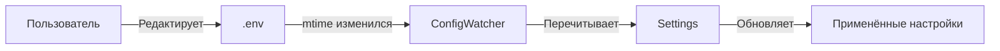

# Конфигурация

## Обзор

Конфигурация караоке-бота осуществляется через переменные окружения, загружаемые из файла `.env`.

## Приоритет загрузки

```
1. Переменные окружения системы (высший приоритет)
2. Файл .env в корне проекта
3. Значения по умолчанию в коде (низший приоритет)
```

## Быстрый старт

1. Скопируйте пример конфигурации:
```bash
cp example.env .env
```

2. Отредактируйте `.env`, указав свои значения:
```bash
# Обязательные
TELEGRAM_BOT_TOKEN=your_token_here
ADMIN_ID=your_telegram_id

# Опциональные (значения по умолчанию подходят для большинства случаев)
TRACKS_ROOT_DIR=/path/to/tracks
LOG_LEVEL=INFO
```

3. Запустите бота:
```bash
uv run python -m app.main
```

## Горячая перезагрузка

Бот поддерживает изменение конфигурации без перезапуска.

### Принцип работы

[`ConfigWatcher`](app/config_watcher.py) мониторит файл `.env` и автоматически применяет изменения:



### Конфигурация

| Переменная | Описание | По умолчанию |
|------------|----------|--------------|
| `ENV_RELOAD_ENABLED` | Включить горячую перезагрузку | `true` |
| `ENV_RELOAD_INTERVAL_SEC` | Интервал проверки (сек) | `30` |

### Что перезагружается

✅ **Перезагружается:**
- Все параметры пайплайна (громкости, пороги)
- Параметры видео (разрешение, качество)
- Провайдеры текстов песен
- Включение/отключение шагов

❌ **Не перезагружается:**
- `TELEGRAM_BOT_TOKEN` — требует рестарта
- `LOG_LEVEL` — требует рестарта
- `TRACKS_ROOT_DIR` — требует рестарта

### Пример

```bash
# Изменение громкости бэк-вокала "на лету"
echo "CHORUS_BACKVOCAL_VOLUME=0.5" >> .env
# Через 30 секунд новое значение применится автоматически
```

---

## Структура .env файла

```bash
# ============================================
# БАЗОВЫЕ НАСТРОЙКИ
# ============================================
LOG_LEVEL=INFO

# ============================================
# TELEGRAM
# ============================================
TELEGRAM_BOT_TOKEN=your_token
ADMIN_ID=123456789
TLG_ALLOWED_ID=[123456789,987654321]

# ============================================
# ПУТИ И ХРАНЕНИЕ
# ============================================
TRACKS_ROOT_DIR=/tracks

# ============================================
# AUDIO PROCESSING
# ============================================
DEMUCS_MODEL=htdemucs
DEMUCS_OUTPUT_FORMAT=mp3
AUDIO_MIX_VOICE_VOLUME=0.4

# ============================================
# SPEECHES.AI (Транскрибация)
# ============================================
SPEECHES_BASE_URL=http://localhost:8001
TRANSCRIPTION_MODEL_ID=Systran/faster-whisper-medium
LANG_DEFAULT=ru
SPEECHES_TIMEOUT=300

# ============================================
# OPENROUTER (LLM)
# ============================================
OPENROUTER_API_KEY=your_key
OPENROUTER_MODEL=qwen/qwen3.5-397b-a17b
OPENROUTER_API=https://openrouter.ai/api/v1

# ============================================
# LYRICS ПРОВАЙДЕРЫ
# ============================================
GENIUS_TOKEN=
LYRICS_ENABLE_GENIUS=false
LYRICS_ENABLE_LYRICA=true
LYRICA_BASE_URL=http://localhost:5000
LYRICS_ENABLE_LYRICSLIB=false

# ============================================
# YANDEX MUSIC
# ============================================
YANDEX_MUSIC_TOKEN=

# ============================================
# YOUTUBE
# ============================================
YOUTUBE_DOWNLOAD_QUALITY=best

# ============================================
# VIDEO RENDER
# ============================================
VIDEO_WIDTH=1280
VIDEO_HEIGHT=720
VIDEO_BACKGROUND_COLOR=black
VIDEO_FFMPEG_PRESET=fast
VIDEO_FFMPEG_CRF=22

# ============================================
# CHORUS DETECTION
# ============================================
DETECT_CHORUS_ENABLED=true
CHORUS_MIN_DURATION_SEC=5.0
CHORUS_VOCAL_SILENCE_THRESHOLD=0.05
CHORUS_BOUNDARY_MERGE_TOLERANCE_SEC=2.0

# ============================================
# MIX AUDIO
# ============================================
MIX_AUDIO_ENABLED=true
CHORUS_BACKVOCAL_VOLUME=0.3
VOCAL_REVERB_ENABLED=false
VOCAL_ECHO_ENABLED=false

# ============================================
# ALIGN
# ============================================
MAX_WORD_TIME=5.0
NORMAL_WORD_TIME=1.5

# ============================================
# ASS SUBTITLES
# ============================================
ASS_FONT_SIZE=60
ASS_PREVIEW_OFFSET=0.5
ASS_COUNTDOWN_ENABLED=true
ASS_COUNTDOWN_SECONDS=3

# ============================================
# OUTPUT
# ============================================
SEND_VIDEO_TO_USER=true
CONTENT_EXTERNAL_URL=https://example.com/music

# ============================================
# FEATURE FLAGS
# ============================================
CORRECT_TRANSCRIPT_ENABLED=true
TRACK_VISUALIZATION_ENABLED=false

# ============================================
# HOT RELOAD
# ============================================
ENV_RELOAD_ENABLED=true
ENV_RELOAD_INTERVAL_SEC=30
```

---

## Типы значений

### Строки
```bash
TELEGRAM_BOT_TOKEN=123456:ABC-DEF...
OPENROUTER_MODEL=qwen/qwen3.5-397b-a17b
```

### Числа
```bash
ADMIN_ID=123456789
VIDEO_WIDTH=1280
AUDIO_MIX_VOICE_VOLUME=0.4
```

### Булевы значения
```bash
# Возможные форматы: true/false, 1/0, yes/no
SEND_VIDEO_TO_USER=true
CORRECT_TRANSCRIPT_ENABLED=1
TRACK_VISUALIZATION_ENABLED=yes
```

### Списки (JSON)
```bash
TLG_ALLOWED_ID=[123456789,987654321]
```

### Пути
```bash
# Относительные или абсолютные
TRACKS_ROOT_DIR=./tracks
TRACKS_ROOT_DIR=/home/user/tracks
TRACKS_ROOT_DIR=I:\karaoke\music  # Windows
```

---

## Валидация

При запуске бот валидирует конфигурацию:

```python
# app/config.py
settings = Settings.from_env()
```

### Обязательные поля
- `TELEGRAM_BOT_TOKEN` — не может быть пустым
- `ADMIN_ID` — должен быть числом

### Проверка диапазонов
```python
ass_countdown_seconds: int = Field(default=3, ge=1, le=5)
```

### Маскирование секретов при логировании
```python
def _mask_value(name: str, value: object) -> object:
    if any(part in name.upper() for part in ("TOKEN", "KEY", "SECRET")):
        return str(value)[:4] + "****"
```

---

## Связанные документы

- [Справочник переменных окружения](./env-reference.md) — полный список всех переменных
- [Архитектура](../architecture/index.md) — обзор компонентов системы
