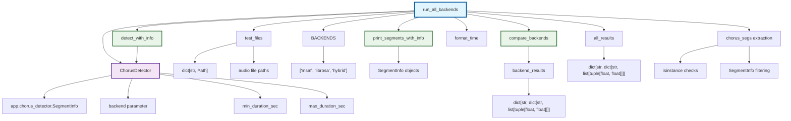

# Зависимости метода run_all_backends

## Описание зависимостей

### Внешние зависимости:
- `ChorusDetector` из `app.chorus_detector` - основной класс для детектирования припевов
- `SegmentInfo` из `app.chorus_detector` - класс для хранения информации о сегментах
- `BACKENDS` - глобальная константа, определяющая доступные бэкенды

### Входные параметры:
- `test_files: dict[str, Path]` - словарь с метками и путями к аудиофайлам

### Внутренние зависимости:
- `detect_with_info()` - метод детектора для получения информации о сегментах
- `print_segments_with_info()` - функция для вывода информации о сегментах
- `compare_backends()` - функция для сравнения результатов разных бэкендов
- `format_time()` - вспомогательная функция для форматирования времени
- `all_results` - внутренняя структура данных для хранения результатов
- `chorus_segs` - логика фильтрации сегментов по типу (chorus/non-chorus)

### Обработка:
- Для каждого бэкенда создается экземпляр `ChorusDetector`
- Для каждого файла вызывается `detect_with_info()` 
- Результаты фильтруются для получения только chorus-сегментов
- Результаты сохраняются во внутреннюю структуру `all_results`
- Вызывается `compare_backends()` для сравнения результатов