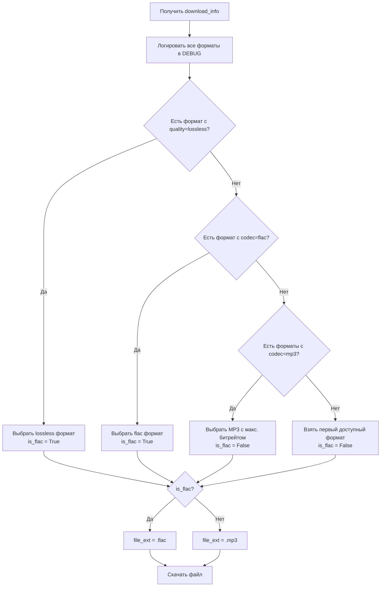

# План итерации 28: Исследование и исправление загрузки FLAC с Яндекс Музыки

## Цель

Исправить загрузку FLAC-версии трека с Яндекс Музыки в модуле [`app/yandex_music_downloader.py`](app/yandex_music_downloader.py). Текущий код ищет `fmt.codec == "flac"`, но не находит совпадений, хотя браузерное расширение успешно скачивает FLAC с качеством `lossless/flac-mp4`.

## Анализ проблемы

### Текущая реализация (проблемный код)

В методе [`download()`](app/yandex_music_downloader.py:131) класса [`YandexMusicDownloader`](app/yandex_music_downloader.py:39):

```python
# Строки 191-199: поиск FLAC
for fmt in download_info:
    if fmt.codec == "flac":          # ← ПРОБЛЕМА: значение "flac" не совпадает
        best_format = fmt
        break

# Строка 224: определение расширения
file_ext = ".flac" if best_format.codec == "flac" else ".mp3"  # ← ПРОБЛЕМА: та же проверка
```

### Предполагаемая причина

Библиотека `yandex-music` (версия `>=2.2.0`) возвращает объекты `DownloadInfo` с полем `codec`, которое для FLAC-версии может содержать значение `"aac"` или другое, а не `"flac"`. Реальный FLAC-контент может идентифицироваться через поле `quality` со значением `"lossless"` или через комбинацию полей.

Согласно описанию задачи, браузерное расширение скачивает FLAC с качеством `lossless/flac-mp4`, что указывает на то, что:
- Поле `quality` может содержать `"lossless"` для FLAC-версии
- Поле `codec` может содержать `"aac"` (так как FLAC в контейнере MP4 использует AAC-совместимый контейнер)

### Структура объекта DownloadInfo (библиотека yandex-music)

Объект `DownloadInfo` содержит следующие поля:
- `codec` — кодек аудио (например: `"mp3"`, `"aac"`, `"flac"`)
- `bitrate_in_kbps` — битрейт в кбит/с
- `gain` — нормализация громкости
- `preview` — признак превью
- `download_info_url` — URL для получения ссылки на скачивание

Для FLAC-версии возможные значения:
- `codec = "aac"` + высокий битрейт (например, 320+ kbps)
- `quality = "lossless"` (если поле существует)
- Или другое специфическое значение

## Диагностический этап

### Шаг 1: Создание диагностического скрипта

Создать скрипт [`scripts/debug_yandex_download_info.py`](scripts/debug_yandex_download_info.py) для исследования структуры `DownloadInfo`.

**Требования к скрипту:**
- Минимум зависимостей: только стандартная библиотека Python (`os`, `pathlib`) и уже установленный пакет `yandex-music`
- Токен берётся из `.env` файла в корне проекта (ключ `YANDEX_MUSIC_TOKEN`) — без использования `python-dotenv` или других сторонних загрузчиков
- Запуск: `uv run python scripts/debug_yandex_download_info.py`

```python
"""Диагностический скрипт для исследования DownloadInfo Яндекс Музыки.

Зависимости: только yandex-music (уже в проекте).
Токен читается из .env в корне проекта (YANDEX_MUSIC_TOKEN).
Запуск: uv run python scripts/debug_yandex_download_info.py
"""
import os
from pathlib import Path

# Минимальная загрузка .env без сторонних библиотек
_env_path = Path(__file__).resolve().parent.parent / ".env"
if _env_path.is_file():
    for _line in _env_path.read_text(encoding="utf-8").splitlines():
        _stripped = _line.strip()
        if _stripped and not _stripped.startswith("#") and "=" in _stripped:
            _key, _value = _stripped.split("=", 1)
            _key = _key.strip()
            if _key and _key not in os.environ:
                os.environ[_key] = _value.strip().strip('"').strip("'")

from yandex_music import Client  # noqa: E402

TRACK_ID = 77362003  # Полина Гагарина — Shallow (Live)

def main() -> None:
    token = os.getenv("YANDEX_MUSIC_TOKEN")
    if not token:
        print("WARN: YANDEX_MUSIC_TOKEN not set — using anonymous access (limited)")

    client = Client(token)
    client.init()

    track = client.tracks(TRACK_ID)[0]
    print(f"Track: {track.title}")
    print(f"Artists: {[a.name for a in (track.artists or [])]}")
    print()

    download_info = track.get_download_info()
    print(f"Total download_info entries: {len(download_info)}")
    print()

    for i, fmt in enumerate(download_info):
        print(f"--- Format #{i} ---")
        for attr in dir(fmt):
            if attr.startswith("_") or callable(getattr(fmt, attr, None)):
                continue
            try:
                print(f"  {attr}: {getattr(fmt, attr)!r}")
            except Exception as exc:
                print(f"  {attr}: ERROR({exc})")
        print()

if __name__ == "__main__":
    main()
```

**Цель:** Получить полный список полей и их значений для всех доступных форматов трека `77362003` без подключения дополнительных зависимостей.

## Исправление кода

### Шаг 2: Анализ результатов диагностики

После запуска скрипта определить:
1. Какое значение имеет поле `codec` для FLAC-версии (предположительно `"aac"` или `"flac"`)
2. Есть ли поле `quality` и какое значение оно принимает для FLAC (`"lossless"`)
3. Какой битрейт у FLAC-версии

### Шаг 3: Исправление метода `download()` в [`app/yandex_music_downloader.py`](app/yandex_music_downloader.py)

**Текущий код (строки 189–224):**

```python
# First, try to find FLAC version (highest quality)
best_format = None
for fmt in download_info:
    if fmt.codec == "flac":
        best_format = fmt
        ...
        break

# If no FLAC, fallback to MP3
if best_format is None:
    for fmt in download_info:
        if fmt.codec == "mp3":
            best_format = fmt
            ...
            break

# Determine file extension based on codec
file_ext = ".flac" if best_format.codec == "flac" else ".mp3"
```

**Исправленный код (с учётом реальных значений полей):**

```python
# Логирование всех доступных форматов для диагностики
for i, fmt in enumerate(download_info):
    logger.debug(
        "YandexMusicDownloader: format #%d: codec=%r, bitrate=%r, quality=%r",
        i,
        getattr(fmt, 'codec', 'N/A'),
        getattr(fmt, 'bitrate_in_kbps', 'N/A'),
        getattr(fmt, 'quality', 'N/A'),
    )

# Стратегия выбора формата:
# 1. Ищем FLAC по полю quality="lossless" (или codec="flac")
# 2. Если не найден — берём MP3 с максимальным битрейтом
# 3. Если и MP3 нет — берём первый доступный формат

best_format = None
is_flac = False

# Попытка 1: поиск по quality="lossless"
for fmt in download_info:
    quality = getattr(fmt, 'quality', None)
    if quality == "lossless":
        best_format = fmt
        is_flac = True
        logger.info(
            "YandexMusicDownloader: found lossless/FLAC format for track %d "
            "(codec=%r, bitrate=%r, quality=%r)",
            track_id,
            getattr(fmt, 'codec', 'N/A'),
            getattr(fmt, 'bitrate_in_kbps', 'N/A'),
            quality,
        )
        break

# Попытка 2: поиск по codec="flac" (на случай если библиотека вернёт именно это)
if best_format is None:
    for fmt in download_info:
        if getattr(fmt, 'codec', None) == "flac":
            best_format = fmt
            is_flac = True
            logger.info(
                "YandexMusicDownloader: found FLAC codec format for track %d (bitrate=%r)",
                track_id,
                getattr(fmt, 'bitrate_in_kbps', 'N/A'),
            )
            break

# Попытка 3: fallback на MP3 с максимальным битрейтом
if best_format is None:
    mp3_formats = [fmt for fmt in download_info if getattr(fmt, 'codec', None) == "mp3"]
    if mp3_formats:
        best_format = max(mp3_formats, key=lambda f: getattr(f, 'bitrate_in_kbps', 0))
        logger.info(
            "YandexMusicDownloader: FLAC not available, using best MP3 for track %d "
            "(bitrate=%r)",
            track_id,
            getattr(best_format, 'bitrate_in_kbps', 'N/A'),
        )

# Попытка 4: первый доступный формат
if best_format is None:
    best_format = download_info[0]
    logger.info(
        "YandexMusicDownloader: using first available format for track %d: "
        "codec=%r, bitrate=%r",
        track_id,
        getattr(best_format, 'codec', 'N/A'),
        getattr(best_format, 'bitrate_in_kbps', 'N/A'),
    )

# Определение расширения файла
file_ext = ".flac" if is_flac else ".mp3"
output_path = output_dir / f"{track_stem}{file_ext}"
```

### Шаг 4: Исправление вызова `track.download()`

Текущий вызов:
```python
track.download(output_path, bitrate_in_kbps=best_format.bitrate_in_kbps)
```

Для FLAC-версии параметр `bitrate_in_kbps` может не работать корректно. Нужно использовать метод `download_info.download()` напрямую или передавать правильные параметры:

```python
# Вариант 1: использовать метод download_info объекта напрямую
best_format.download(str(output_path))

# Вариант 2: использовать track.download с codec параметром
# track.download(output_path, codec=best_format.codec, bitrate_in_kbps=best_format.bitrate_in_kbps)
```

**Примечание:** Конкретный вариант определяется после диагностики API библиотеки.

## Детальный план файлов для изменения

### Файл 1: [`app/yandex_music_downloader.py`](app/yandex_music_downloader.py)

**Изменения в методе `download()` (строки 183–233):**

1. Добавить логирование всех доступных форматов в DEBUG-режиме
2. Изменить логику поиска FLAC:
   - Сначала искать по `quality == "lossless"`
   - Затем по `codec == "flac"` (как запасной вариант)
3. Для MP3 fallback — выбирать формат с максимальным битрейтом
4. Исправить определение расширения файла через флаг `is_flac`
5. Проверить корректность вызова метода скачивания

### Файл 2: [`scripts/debug_yandex_download_info.py`](scripts/debug_yandex_download_info.py) (новый)

Диагностический скрипт для исследования структуры `DownloadInfo`. Используется только для отладки, не входит в основной код приложения.

## Схема логики выбора формата



## Порядок выполнения

### Этап 1: Диагностика (исследование)

1. **Создать диагностический скрипт** [`scripts/debug_yandex_download_info.py`](scripts/debug_yandex_download_info.py)
   - Скрипт выводит все поля объектов `DownloadInfo` для трека `77362003`
   - Запускается через `uv run python scripts/debug_yandex_download_info.py`

2. **Запустить скрипт** и проанализировать вывод:
   - Определить значение поля `codec` для FLAC-версии
   - Определить наличие и значение поля `quality`
   - Определить битрейт FLAC-версии

### Этап 2: Исправление кода

3. **Исправить метод `download()`** в [`app/yandex_music_downloader.py`](app/yandex_music_downloader.py):
   - Обновить логику поиска FLAC-формата с учётом реальных значений полей
   - Добавить DEBUG-логирование всех доступных форматов
   - Исправить определение расширения файла
   - Убедиться в корректности вызова метода скачивания

4. **Проверить** загрузку трека `77362003`:
   - Запустить бота и отправить ссылку `https://music.yandex.ru/album/13708253/track/77362003`
   - Убедиться, что скачивается файл с расширением `.flac`
   - Проверить, что пайплайн продолжает работу с FLAC-файлом

## Проверка результата

После реализации:
1. При загрузке трека `77362003` (Полина Гагарина — Shallow Live) скачивается файл с расширением `.flac`
2. В логах видно сообщение о выборе lossless/FLAC формата
3. Пайплайн успешно обрабатывает FLAC-файл (Demucs поддерживает FLAC)
4. При отсутствии FLAC-версии корректно используется MP3 с максимальным битрейтом

## Возможные риски и решения

| Риск | Решение |
|------|---------|
| Поле `quality` отсутствует в объекте `DownloadInfo` | Использовать `getattr(fmt, 'quality', None)` для безопасного доступа |
| FLAC скачивается, но Demucs не поддерживает формат | Проверить поддержку FLAC в DemucsService; при необходимости добавить конвертацию через ffmpeg |
| Метод `track.download()` не поддерживает FLAC | Использовать `best_format.download()` напрямую |
| Разные версии библиотеки yandex-music имеют разный API | Использовать `getattr()` для безопасного доступа к полям |

## Зависимости

- Библиотека `yandex-music>=2.2.0` (уже установлена)
- Токен Яндекс Музыки (`YANDEX_MUSIC_TOKEN` в `.env`) — необходим для доступа к FLAC-версиям
- Трек `77362003` должен быть доступен в аккаунте пользователя с подпиской Яндекс Музыки (FLAC доступен только по подписке)
