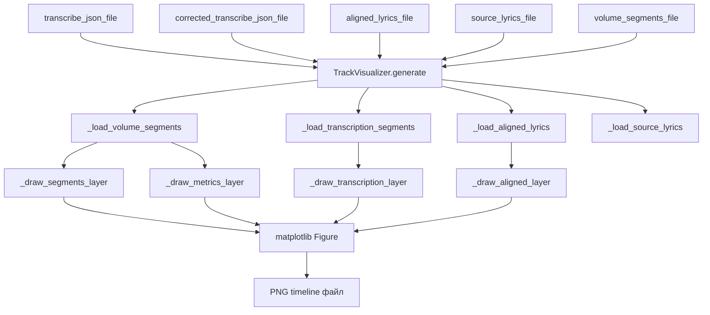

# Итерация 38 — Графическая визуализация сегментирования трека

## Цель

Создать отделяемый модуль [`app/track_visualizer.py`](../app/track_visualizer.py), который принимает на вход только ссылки на готовые файлы-артефакты пайплайна и формирует графический timeline с метриками и потоками данных, сохраняя результат в PNG-файл.

Модуль является **автономным**: не зависит от состояния пайплайна, не импортирует другие модули `app/`, работает только с переданными путями к файлам.

---

## Входные данные

Модуль принимает только пути к файлам (все опциональны, но хотя бы один должен быть передан):

| Параметр | Тип | Описание |
|---|---|---|
| `transcribe_json_file` | `Path \| None` | JSON с результатом транскрибации (шаг TRANSCRIBE) |
| `corrected_transcribe_json_file` | `Path \| None` | Скорректированный JSON транскрипции (шаг CORRECT_TRANSCRIPT) |
| `aligned_lyrics_file` | `Path \| None` | JSON с выровненным текстом и таймкодами (шаг ALIGN) |
| `source_lyrics_file` | `Path \| None` | TXT или LRC с текстом песни (шаг GET_LYRICS) |
| `volume_segments_file` | `Path \| None` | JSON с разметкой сегментов (шаг DETECT_CHORUS) |

---

## Выходные данные

Один PNG-файл с графическим timeline треком. Путь к файлу задаётся при вызове метода `generate()`.

---

## Архитектура модуля

### Класс `TrackVisualizer` в [`app/track_visualizer.py`](../app/track_visualizer.py)

```python
class TrackVisualizer:
    """Генерирует графический timeline сегментирования трека.

    Принимает пути к файлам-артефактам пайплайна и формирует PNG-изображение
    с временной шкалой, метриками сегментов и потоками данных.
    """

    def __init__(
        self,
        width_px: int = 1920,
        height_px: int = 1080,
        dpi: int = 96,
    ) -> None: ...

    def generate(
        self,
        output_path: Path,
        transcribe_json_file: Path | None = None,
        corrected_transcribe_json_file: Path | None = None,
        aligned_lyrics_file: Path | None = None,
        source_lyrics_file: Path | None = None,
        volume_segments_file: Path | None = None,
        track_title: str = "",
    ) -> None:
        """Сгенерировать PNG-файл с визуализацией.

        Raises:
            ValueError: если ни один входной файл не передан или все отсутствуют.
        """
```

---

## Структура визуализации

### Компоновка изображения (сверху вниз)

```
┌─────────────────────────────────────────────────────────────────┐
│  Заголовок: название трека + временной диапазон                  │
├─────────────────────────────────────────────────────────────────┤
│  Временная шкала (ось X = время в секундах)                      │
├─────────────────────────────────────────────────────────────────┤
│  Слой 1: Сегменты (volume_segments_file)                         │
│    ████ chorus  ░░░░ verse  ████ chorus  ░░░░ outro              │
│    [тип] [vol] [energy] [sim] [hpss]                             │
├─────────────────────────────────────────────────────────────────┤
│  Слой 2: Транскрипция (transcribe_json_file)                     │
│    ▓▓▓▓▓▓▓▓▓▓▓▓▓▓▓▓▓▓▓▓▓▓▓▓▓▓▓▓▓▓▓▓▓▓▓▓▓▓▓▓▓▓▓▓▓▓▓▓▓▓▓▓▓▓▓▓▓▓▓▓ │
│    [сегменты транскрипции с текстом]                             │
├─────────────────────────────────────────────────────────────────┤
│  Слой 3: Скорр. транскрипция (corrected_transcribe_json_file)    │
│    ▓▓▓▓▓▓▓▓▓▓▓▓▓▓▓▓▓▓▓▓▓▓▓▓▓▓▓▓▓▓▓▓▓▓▓▓▓▓▓▓▓▓▓▓▓▓▓▓▓▓▓▓▓▓▓▓▓▓▓▓ │
│    [сегменты скорр. транскрипции с текстом]                      │
├─────────────────────────────────────────────────────────────────┤
│  Слой 4: Выровненный текст (aligned_lyrics_file)                 │
│    ▓▓▓▓▓▓▓▓▓▓▓▓▓▓▓▓▓▓▓▓▓▓▓▓▓▓▓▓▓▓▓▓▓▓▓▓▓▓▓▓▓▓▓▓▓▓▓▓▓▓▓▓▓▓▓▓▓▓▓▓ │
│    [строки текста с таймкодами]                                  │
├─────────────────────────────────────────────────────────────────┤
│  Слой 5: Метрики сегментов (графики)                             │
│    vocal_energy: ▁▂▄▇█▇▄▂▁                                      │
│    sim_score:    ▁▃▅▇█▇▅▃▁                                       │
│    hpss_score:   ▁▂▃▅▇▅▃▂▁                                       │
├─────────────────────────────────────────────────────────────────┤
│  Легенда: цвета типов сегментов + описание метрик                │
└─────────────────────────────────────────────────────────────────┘
```

### Цветовая схема сегментов

| Тип сегмента | Цвет | Описание |
|---|---|---|
| `chorus` | `#FF6B6B` (красный) | Припев |
| `verse` | `#4ECDC4` (бирюзовый) | Куплет |
| `bridge` | `#45B7D1` (голубой) | Бридж |
| `intro` | `#96CEB4` (зелёный) | Интро |
| `outro` | `#FFEAA7` (жёлтый) | Аутро |
| `instrumental` | `#DDA0DD` (сиреневый) | Инструментал |
| `unknown` | `#CCCCCC` (серый) | Неизвестный тип |

---

## Детальный план реализации

### Шаг 1. Добавить зависимость `matplotlib`

```bash
uv add matplotlib
```

> `numpy` уже установлен как зависимость `librosa`.

### Шаг 2. Создать файл [`app/track_visualizer.py`](../app/track_visualizer.py)

**Зависимости:**
- `matplotlib` — основная библиотека для построения графиков
- `numpy` — для работы с числовыми данными
- Стандартная библиотека: `json`, `pathlib`, `logging`

### Шаг 3. Реализовать загрузчики данных (приватные методы)

```python
def _load_volume_segments(self, path: Path) -> list[dict]:
    """Загрузить сегменты из volume_segments_file."""

def _load_transcription_segments(self, path: Path) -> tuple[list[dict], list[dict]]:
    """Загрузить segments и words из transcription JSON.
    
    Returns: (segments, words)
    """

def _load_aligned_lyrics(self, path: Path) -> tuple[list[dict], list[dict]]:
    """Загрузить segments и words из aligned_lyrics JSON.
    
    Returns: (segments, words)
    """

def _load_source_lyrics(self, path: Path) -> list[str]:
    """Загрузить строки текста из TXT или LRC файла.
    
    Для LRC — парсить таймкоды и возвращать строки с временными метками.
    """
```

### Шаг 4. Реализовать вычисление временного диапазона

```python
def _compute_duration(
    self,
    volume_segments: list[dict],
    transcription_segments: list[dict],
    aligned_segments: list[dict],
) -> float:
    """Определить общую длительность трека из доступных данных."""
```

### Шаг 5. Реализовать отрисовку слоёв

#### Слой сегментов (volume_segments_file)

```python
def _draw_segments_layer(
    self,
    ax: "matplotlib.axes.Axes",
    segments: list[dict],
    duration: float,
    y_pos: float,
    height: float,
) -> None:
    """Нарисовать цветные прямоугольники сегментов с подписями."""
```

Для каждого сегмента:
- Цветной прямоугольник по временному диапазону
- Подпись: `[тип]\nvol:{volume:.2f}\nenergy:{vocal_energy:.2f}`
- Цвет по типу сегмента из цветовой схемы

#### Слой транскрипции

```python
def _draw_transcription_layer(
    self,
    ax: "matplotlib.axes.Axes",
    segments: list[dict],
    duration: float,
    y_pos: float,
    height: float,
    label: str,
    color: str,
) -> None:
    """Нарисовать сегменты транскрипции с текстом."""
```

Для каждого сегмента:
- Прямоугольник с заливкой
- Текст сегмента (обрезанный до ~30 символов)
- Временные метки start/end

#### Слой выровненного текста

```python
def _draw_aligned_layer(
    self,
    ax: "matplotlib.axes.Axes",
    segments: list[dict],
    duration: float,
    y_pos: float,
    height: float,
) -> None:
    """Нарисовать строки выровненного текста."""
```

#### Слой метрик (графики)

```python
def _draw_metrics_layer(
    self,
    ax: "matplotlib.axes.Axes",
    segments: list[dict],
    duration: float,
    y_pos: float,
    height: float,
) -> None:
    """Нарисовать ступенчатые графики метрик сегментов.
    
    Метрики: vocal_energy, sim_score, hpss_score.
    Каждая метрика — отдельная линия с подписью.
    """
```

### Шаг 6. Реализовать основной метод `generate()`

**Алгоритм:**

1. Загрузить все доступные данные через загрузчики
2. Вычислить общую длительность трека
3. Создать `matplotlib.figure.Figure` с нужными размерами
4. Создать один `Axes` с общей осью X (время)
5. Отрисовать слои снизу вверх:
   - Слой метрик (нижний)
   - Слой выровненного текста
   - Слой скорр. транскрипции (если есть)
   - Слой транскрипции
   - Слой сегментов (верхний)
6. Настроить ось X: временная шкала в секундах с метками каждые 30 сек
7. Добавить заголовок и легенду
8. Сохранить в PNG через `fig.savefig(output_path, dpi=self._dpi, bbox_inches="tight")`
9. Закрыть фигуру (`plt.close(fig)`)

### Шаг 7. Создать скрипт для ручного запуска

**Файл:** [`scripts/visualize_track.py`](../scripts/visualize_track.py)

```python
"""Скрипт для ручной генерации визуализации timeline трека.

Использование:
    uv run python scripts/visualize_track.py <path_to_track_dir>

Пример:
    uv run python scripts/visualize_track.py tracks/Godsmack - Nothing Else Matters
"""
```

Скрипт:
1. Принимает путь к папке трека как аргумент командной строки
2. Читает `state.json` из папки трека
3. Извлекает пути к файлам-артефактам
4. Вызывает `TrackVisualizer.generate()`
5. Выводит путь к сгенерированному PNG

---

## Диаграмма потоков данных



---

## Изменяемые файлы

| Файл | Тип изменений |
|------|--------------|
| [`app/track_visualizer.py`](../app/track_visualizer.py) | Новый файл: класс `TrackVisualizer` |
| [`pyproject.toml`](../pyproject.toml) | Добавить зависимость `matplotlib` |
| [`scripts/visualize_track.py`](../scripts/visualize_track.py) | Новый скрипт для ручного запуска |

---

## Что НЕ меняется

- Структура [`VolumeSegment`](../app/chorus_detector.py) — читается как есть из JSON
- Логика пайплайна — модуль полностью автономен
- Форматы входных файлов — модуль только читает, не изменяет
- Все существующие шаги пайплайна — без изменений

> Интеграция `TrackVisualizer` в пайплайн (вызов из шага `GENERATE_ASS`, конфигурация `TRACK_VISUALIZATION_ENABLED`, поле `visualization_file` в `PipelineState`) — вынесена в **итерацию 39**.

---

## Проверка

- Скрипт [`scripts/visualize_track.py`](../scripts/visualize_track.py) успешно генерирует PNG по папке трека
- PNG содержит все доступные слои данных (только те, для которых переданы файлы)
- При отсутствии `volume_segments_file` слой сегментов и метрик не отображается
- При отсутствии `aligned_lyrics_file` слой выровненного текста не отображается
- Класс `TrackVisualizer` не импортирует ни один модуль из `app/` (кроме стандартной библиотеки и `matplotlib`/`numpy`)

---

## Зависимости

- `matplotlib>=3.7` — основная библиотека визуализации (добавить через `uv add matplotlib`)
- `numpy` — уже установлен как зависимость `librosa`
- Стандартная библиотека Python: `json`, `pathlib`, `logging`, `sys`, `argparse`
