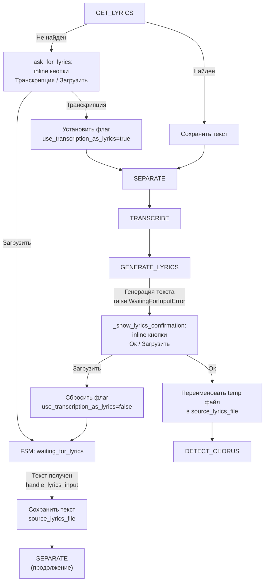

# Итерация 42: Доработка шага GET_LYRICS с fallback на транскрипцию

## Цель итерации

Доработать шаг `GET_LYRICS` так, чтобы при отсутствии возможности скачать текст песни из внешних сервисов, пользователю предлагался выбор: использовать текст из транскрипции (`segments`) или загрузить текст вручную.

## Общая логика

```
[GET_LYRICS] 
    ↓ (текст не найден в сервисах)
[Выбор источника] ← inline кнопки: [📝 Транскрипция] [📤 Загрузить]
    │
    ├──→ [Транскрипция]: установка флага use_transcription_as_lyrics=true
    │                      ↓
    │                 [SEPARATE] → [TRANSCRIBE] → [GENERATE_LYRICS]
    │                                                      ↓
    │                         (генерация текста из segments, raise WaitingForInputError)
    │                                                      ↓
    │                                 [Предпросмотр текста] ← inline кнопки: [✅ Ок] [📤 Загрузить]
    │                                                      ↓
    │                                            [Ок] → сохранение в source_lyrics_file
    │                                                      ↓
    │                                               продолжение с DETECT_CHORUS
    │
    └──→ [Загрузить] → FSM waiting_for_lyrics → сохранение текста → продолжение с SEPARATE
```

## Новый шаг пайплайна

### `GENERATE_LYRICS`

Шаг выполняется **только** если установлен флаг `use_transcription_as_lyrics=true`:
- Генерирует текст песни из `segments` транскрипции
- Сохраняет сгенерированный текст во временный файл
- Выбрасывает `WaitingForInputError` для ожидания подтверждения пользователя

Шаг пропускается, если флаг не установлен или уже есть `source_lyrics_file`.

## Изменения в моделях (app/models.py)

### 1. Новое поле в PipelineState

```python
class PipelineState(BaseModel):
    # ... существующие поля ...
    # Флаг для использования транскрипции как текста песни (когда lyrics не найден)
    use_transcription_as_lyrics: bool = False
```

### 2. Новый шаг PipelineStep

```python
class PipelineStep(str, Enum):
    # ... существующие шаги ...
    GET_LYRICS = "GET_LYRICS"
    SEPARATE = "SEPARATE"
    TRANSCRIBE = "TRANSCRIBE"
    GENERATE_LYRICS = "GENERATE_LYRICS"  # NEW
    DETECT_CHORUS = "DETECT_CHORUS"
    # ... остальные шаги ...
```

### 3. Новые FSM-состояния

```python
class LyricsChoiceStates(StatesGroup):
    """FSM для выбора источника текста песни (транскрипция или загрузка)."""
    waiting_for_choice = State()


class LyricsConfirmStates(StatesGroup):
    """FSM для подтверждения текста песни, сгенерированного из транскрипции."""
    waiting_for_confirmation = State()
```

## Изменения в LyricsService (app/lyrics_service.py)

### Новый метод `generate_lyrics_from_transcription`

```python
@staticmethod
def generate_lyrics_from_transcription(transcription_json_path: Path) -> str:
    """Генерирует текст песни из segments транскрипции.
    
    Формат segments (после шага TRANSCRIBE и _cleanup_transcription):
    {
        "segments": [
            {"id": 0, "start": 0.0, "end": 2.5, "text": "текст строки"},
            ...
        ]
    }
    
    Returns:
        Строка с текстом песни, объединённые сегменты через перенос строки.
    """
```

**Алгоритм:**
1. Чтение JSON-файла транскрипции
2. Извлечение `segments` списка
3. Для каждого сегмента берём `text`, strip()
4. Объединяем через `\n`
5. Возвращаем результат

## Изменения в Pipeline (app/pipeline.py)

### 1. Обновление `_ORDERED_STEPS`

```python
_ORDERED_STEPS: list[PipelineStep] = [
    PipelineStep.DOWNLOAD,
    PipelineStep.ASK_LANGUAGE,
    PipelineStep.GET_LYRICS,
    PipelineStep.SEPARATE,
    PipelineStep.TRANSCRIBE,
    PipelineStep.GENERATE_LYRICS,  # NEW
    PipelineStep.DETECT_CHORUS,
    PipelineStep.CORRECT_TRANSCRIPT,
    PipelineStep.ALIGN,
    PipelineStep.MIX_AUDIO,
    PipelineStep.GENERATE_ASS,
    PipelineStep.RENDER_VIDEO,
    PipelineStep.SEND_VIDEO,
]
```

### 2. Обновление `_STEP_REQUIRED_ARTIFACTS`

```python
_STEP_REQUIRED_ARTIFACTS: dict[PipelineStep, list[str]] = {
    # ... существующие шаги ...
    PipelineStep.GENERATE_LYRICS: ["transcribe_json_file"],
    # ... остальные шаги ...
}
```

### 3. Обновление `_STEP_LABELS`

```python
_STEP_LABELS: dict[PipelineStep, str] = {
    # ... существующие шаги ...
    PipelineStep.GENERATE_LYRICS: "генерация текста песни из транскрипции",
    # ... остальные шаги ...
}
```

### 4. Обновление `_step_get_lyrics`

**Текущее поведение:** при `lyrics is None` выбрасывается `LyricsNotFoundError`

**Новое поведение:** 
- При отсутствии текста из сервисов — выбрасывать `LyricsNotFoundError` (для FSM выбора)

```python
async def _step_get_lyrics(self) -> None:
    # ... проверка существующего файла ...
    
    # ... попытка получить текст из сервисов ...
    lyrics = await lyrics_service.find_lyrics(...)
    
    if lyrics is None:
        # Запрос у пользователя (через FSM с кнопками)
        raise LyricsNotFoundError(f"Не удалось автоматически найти текст для '{stem}'")
    
    # ... сохранение lyrics ...
```

### 5. Новый метод `_step_generate_lyrics`

```python
async def _step_generate_lyrics(self) -> None:
    """Генерирует текст из транскрипции и ждёт подтверждения пользователя.
    
    Шаг выполняется только если:
    - use_transcription_as_lyrics=True
    - source_lyrics_file ещё не установлен
    """
    # Пропуск если флаг не установлен
    if not self._state.use_transcription_as_lyrics:
        logger.info("GENERATE_LYRICS skipped: flag not set")
        return
    
    # Пропуск если текст уже есть
    if self._state.source_lyrics_file:
        logger.info("GENERATE_LYRICS skipped: lyrics already exists")
        return
    
    # Проверка наличия транскрипции
    if not self._state.transcribe_json_file:
        raise RuntimeError("transcribe_json_file не задан")
    
    # Генерация текста
    lyrics = LyricsService.generate_lyrics_from_transcription(
        Path(self._state.transcribe_json_file)
    )
    
    # Сохранение во временный файл
    raw_stem = self._state.track_stem or "track"
    stem = normalize_filename(raw_stem)
    track_dir = self._track_folder
    temp_lyrics_file = track_dir / f"{stem}_lyrics_temp.txt"
    temp_lyrics_file.write_text(lyrics, encoding="utf-8")
    
    # Сохраняем путь к временному файлу в состоянии
    self._state.temp_lyrics_file = str(temp_lyrics_file)
    self._save_state()
    
    # Ожидание подтверждения пользователя
    raise WaitingForInputError("Ожидание подтверждения текста из транскрипции")
```

### 6. Добавление в `step_methods`

```python
step_methods: dict[PipelineStep, Callable[[], Awaitable[None]]] = {
    # ... существующие шаги ...
    PipelineStep.GENERATE_LYRICS: self._step_generate_lyrics,
    # ... остальные шаги ...
}
```

## Изменения в Handlers (app/handlers_karaoke.py)

### 1. Обновление `_ask_for_lyrics` (выбор источника)

**Текущее:** простой текстовый запрос.

**Новое:** inline-клавиатура с выбором:

```python
async def _ask_for_lyrics(
    self,
    message: types.Message,
    state: FSMContext,
    track_id: str,
    track_dir: Path,
    pipeline_state: PipelineState | None = None,
) -> None:
    await state.set_state(LyricsChoiceStates.waiting_for_choice)
    await state.update_data(track_id=track_id, track_folder=str(track_dir))
    
    keyboard = InlineKeyboardMarkup(
        inline_keyboard=[
            [
                InlineKeyboardButton(text="📝 Транскрипция", callback_data="lyrics_choice:transcription"),
                InlineKeyboardButton(text="📤 Загрузить", callback_data="lyrics_choice:upload"),
            ]
        ]
    )
    
    text = "🎵 Не удалось автоматически найти текст песни.\n\nВыберите вариант:"
    # ... отправка/редактирование сообщения ...
```

### 2. Новый метод `_show_lyrics_confirmation` (подтверждение текста)

```python
async def _show_lyrics_confirmation(
    self,
    message: types.Message,
    state: FSMContext,
    track_id: str,
    track_dir: Path,
    pipeline_state: PipelineState | None = None,
) -> None:
    """Показать пользователю сгенерированный текст для подтверждения."""
    await state.set_state(LyricsConfirmStates.waiting_for_confirmation)
    await state.update_data(track_id=track_id, track_folder=str(track_dir))
    
    # Читаем временный файл с текстом
    state_path = track_dir / "state.json"
    pipeline_state = PipelineState.model_validate_json(state_path.read_text(encoding="utf-8"))
    temp_lyrics_path = Path(pipeline_state.temp_lyrics_file) if pipeline_state.temp_lyrics_file else None
    
    if temp_lyrics_path and temp_lyrics_path.exists():
        lyrics = temp_lyrics_path.read_text(encoding="utf-8")
    else:
        lyrics = "[Ошибка: текст не найден]"
    
    keyboard = InlineKeyboardMarkup(
        inline_keyboard=[
            [
                InlineKeyboardButton(text="✅ Ок", callback_data="lyrics_confirm:ok"),
                InlineKeyboardButton(text="📤 Загрузить", callback_data="lyrics_confirm:upload"),
            ]
        ]
    )
    
    # Отправляем первые 1000 символов текста
    preview = lyrics[:1000] + "..." if len(lyrics) > 1000 else lyrics
    text = f"📝 Текст, сгенерированный из транскрипции:\n\n<pre>{preview}</pre>\n\nПодтвердить или загрузить свой?"
    
    # ... отправка/редактирование сообщения ...
```

### 3. Обработчик callback `lyrics_choice:transcription`

```python
@self.router.callback_query(LyricsChoiceStates.waiting_for_choice, F.data == "lyrics_choice:transcription")
async def handle_lyrics_choice_transcription(callback: types.CallbackQuery, state: FSMContext) -> None:
    """Пользователь выбрал использовать транскрипцию."""
    # Получаем данные из FSM
    data = await state.get_data()
    track_id = data.get("track_id")
    track_folder = data.get("track_folder")
    
    # Читаем state.json
    track_dir = Path(track_folder)
    state_path = track_dir / "state.json"
    pipeline_state = PipelineState.model_validate_json(state_path.read_text(encoding="utf-8"))
    
    # Устанавливаем флаг
    pipeline_state.use_transcription_as_lyrics = True
    state_path.write_text(pipeline_state.model_dump_json(indent=2), encoding="utf-8")
    
    # Очищаем FSM
    await state.clear()
    await callback.answer("Выбран вариант с транскрипцией")
    
    # Продолжаем пайплайн с SEPARATE
    await self._run_from_step(callback.message, track_dir, pipeline_state, PipelineStep.SEPARATE, state)
```

### 4. Обработчик callback `lyrics_choice:upload`

```python
@self.router.callback_query(LyricsChoiceStates.waiting_for_choice, F.data == "lyrics_choice:upload")
async def handle_lyrics_choice_upload(callback: types.CallbackQuery, state: FSMContext) -> None:
    """Пользователь выбрал загрузить текст вручную."""
    # Переходим в FSM ожидания текста
    await state.set_state(LyricsStates.waiting_for_lyrics)
    
    await callback.answer("Ожидаю текст песни")
    await callback.message.edit_text(
        "Пожалуйста, пришлите полный текст песни в следующем сообщении."
    )
```

### 5. Обработчик callback `lyrics_confirm:ok`

```python
@self.router.callback_query(LyricsConfirmStates.waiting_for_confirmation, F.data == "lyrics_confirm:ok")
async def handle_lyrics_confirm_ok(callback: types.CallbackQuery, state: FSMContext) -> None:
    """Пользователь подтвердил текст из транскрипции."""
    # Получаем данные из FSM
    data = await state.get_data()
    track_id = data.get("track_id")
    track_folder = data.get("track_folder")
    
    # Читаем state.json
    track_dir = Path(track_folder)
    state_path = track_dir / "state.json"
    pipeline_state = PipelineState.model_validate_json(state_path.read_text(encoding="utf-8"))
    
    # Переименовываем временный файл в финальный
    temp_path = Path(pipeline_state.temp_lyrics_file)
    stem = pipeline_state.track_stem or "track"
    final_path = track_dir / f"{stem}_lyrics.txt"
    temp_path.rename(final_path)
    
    # Обновляем состояние
    pipeline_state.source_lyrics_file = str(final_path)
    pipeline_state.temp_lyrics_file = None
    state_path.write_text(pipeline_state.model_dump_json(indent=2), encoding="utf-8")
    
    # Очищаем FSM
    await state.clear()
    await callback.answer("Текст подтверждён")
    
    # Продолжаем с DETECT_CHORUS (после GENERATE_LYRICS)
    await self._run_from_step(callback.message, track_dir, pipeline_state, PipelineStep.DETECT_CHORUS, state)
```

### 6. Обработчик callback `lyrics_confirm:upload`

```python
@self.router.callback_query(LyricsConfirmStates.waiting_for_confirmation, F.data == "lyrics_confirm:upload")
async def handle_lyrics_confirm_upload(callback: types.CallbackQuery, state: FSMContext) -> None:
    """Пользователь хочет загрузить свой текст вместо транскрипции."""
    # Получаем данные
    data = await state.get_data()
    track_folder = data.get("track_folder")
    
    # Сбрасываем флаг
    track_dir = Path(track_folder)
    state_path = track_dir / "state.json"
    pipeline_state = PipelineState.model_validate_json(state_path.read_text(encoding="utf-8"))
    pipeline_state.use_transcription_as_lyrics = False
    pipeline_state.temp_lyrics_file = None
    state_path.write_text(pipeline_state.model_dump_json(indent=2), encoding="utf-8")
    
    # Удаляем временный файл если есть
    if pipeline_state.temp_lyrics_file:
        temp_path = Path(pipeline_state.temp_lyrics_file)
        if temp_path.exists():
            temp_path.unlink()
    
    # Переходим в FSM ожидания текста
    await state.set_state(LyricsStates.waiting_for_lyrics)
    
    await callback.answer("Ожидаю текст песни")
    await callback.message.edit_text(
        "Пожалуйста, пришлите полный текст песни в следующем сообщении."
    )
```

### 7. Обновление обработки `LyricsNotFoundError` в `_start_pipeline`

```python
except LyricsNotFoundError:
    # Pipeline paused at GET_LYRICS — ask user for lyrics choice
    pipeline_state = pipeline.state
    new_track_dir = pipeline.track_folder
    
    pipeline_state.notification_chat_id = notification_chat_id
    pipeline_state.notification_message_id = notification_message_id
    new_state_path = new_track_dir / "state.json"
    try:
        new_state_path.write_text(pipeline_state.model_dump_json(indent=2), encoding="utf-8")
    except OSError as exc:
        self._logger.error("Failed to update state.json for lyrics request: %s", exc)
    
    await self._ask_for_lyrics(message, state, track_id, new_track_dir, pipeline_state)
    return
```

### 8. Обновление обработки `WaitingForInputError` в `_start_pipeline`

Добавить проверку текущего шага для определения, какое именно ожидание:

```python
except WaitingForInputError:
    pipeline_state = pipeline.state
    new_track_dir = pipeline.track_folder
    
    # Определяем, какой шаг вызвал ожидание
    current_step = pipeline_state.current_step
    
    if current_step == PipelineStep.ASK_LANGUAGE:
        # ... существующая логика для выбора языка ...
    elif current_step == PipelineStep.GENERATE_LYRICS:
        # Показываем подтверждение текста
        await self._show_lyrics_confirmation(message, state, track_id, new_track_dir, pipeline_state)
    
    return
```

### 9. Обновление импортов

```python
from .models import (
    LyricsChoiceStates,
    LyricsConfirmStates,
    # ... существующие импорты ...
)
```

## Mermaid-диаграмма потока



### 10. Команда `/step_generate_lyrics`

Добавить обработчик команды для ручного запуска шага `GENERATE_LYRICS`:

```python
@self.router.message(Command("step_generate_lyrics"))
async def handle_step_generate_lyrics(message: types.Message, state: FSMContext) -> None:
    if not self._is_user_allowed(message):
        await self._reject_unauthorized(message)
        return
    await self._handle_step_command(message, PipelineStep.GENERATE_LYRICS, state)
```

### 11. Обновление docs/bot_commands.md

Добавить команду в список для BotFather и в таблицу шагов:

```markdown
step_generate_lyrics - Генерация текста песни из транскрипции
```

| Шаг | Команда запуска | Описание |
|---|---|---|
| `GENERATE_LYRICS` | `/step_generate_lyrics` | Генерация текста песни из сегментов транскрипции (fallback при отсутствии текста из внешних сервисов). Выполняется только при `use_transcription_as_lyrics=true`. |

## Критерии приёмки

1. При отсутствии текста в сервисах пользователю показывается inline-клавиатура с кнопками "📝 Транскрипция" и "📤 Загрузить"
2. При нажатии "Транскрипция" устанавливается флаг `use_transcription_as_lyrics=true`, пайплайн продолжается
3. После шага `TRANSCRIBE` выполняется шаг `GENERATE_LYRICS` (только при флаге)
4. Пользователю показывается предпросмотр сгенерированного текста с кнопками "✅ Ок" и "📤 Загрузить"
5. При нажатии "Ок" текст сохраняется и пайплайн продолжается
6. При нажатии "Загрузить" (в любом месте) система переходит в режим ожидания текста от пользователя
7. При ручной загрузке текста пайплайн продолжается корректно
8. Команда `/step_generate_lyrics` доступна для ручного запуска шага
