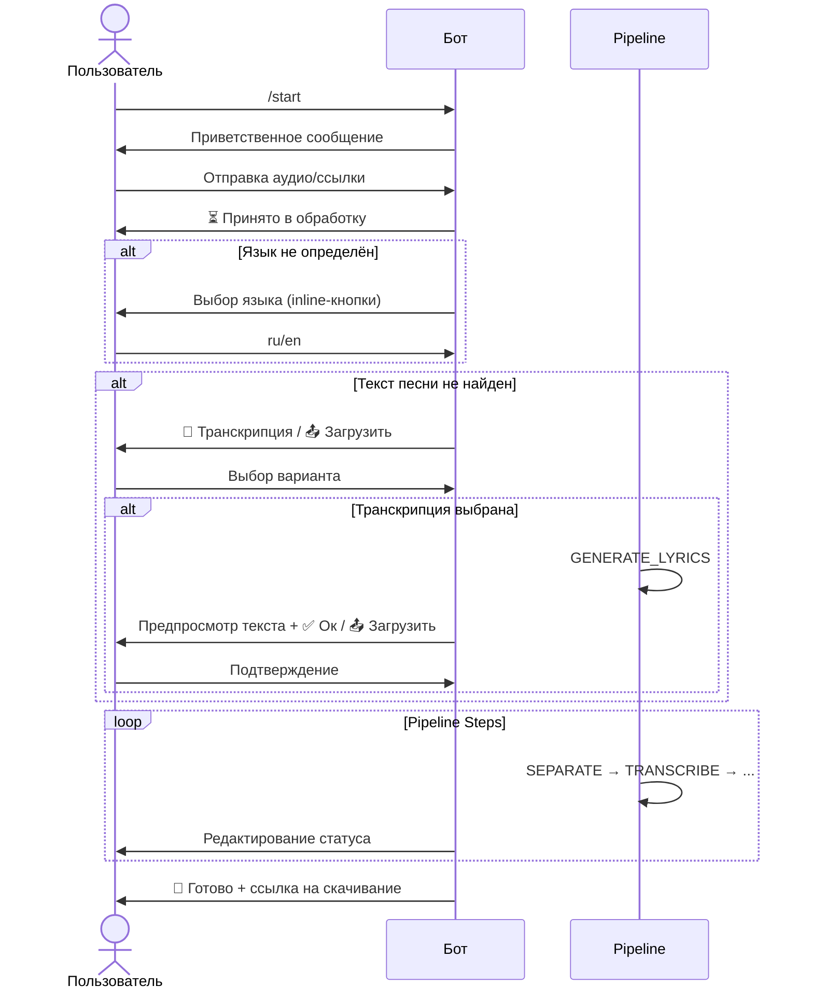
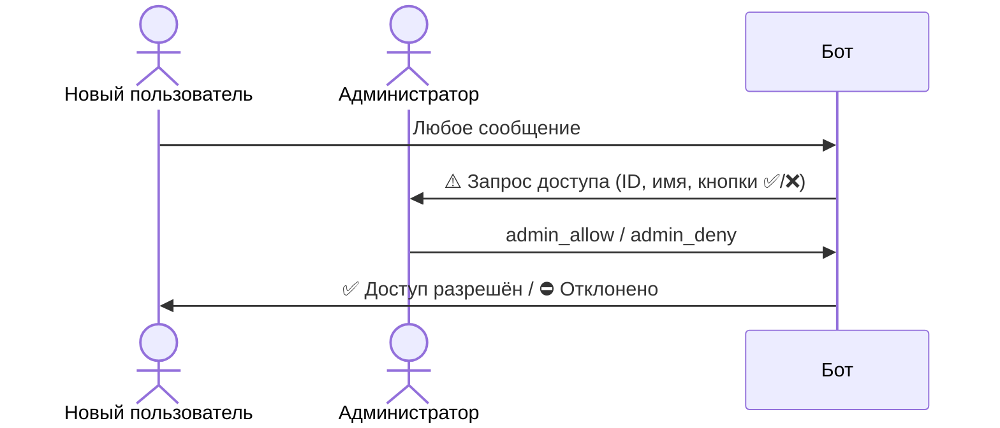

# Итерация 50: Документирование — Архитектура + Конфигурация

## Цель
Создать архитектурную документацию и справочник конфигурации проекта.

## Создаваемые документы

### Архитектура

#### `docs/architecture/index.md`
- Высокоуровневая схема системы
- Три слоя: Telegram-интерфейс, Доменный пайплайн, Интеграции
- Технологический стек (таблица)
- Mermaid-диаграмма общей архитектуры

#### `docs/architecture/components.md`
- Описание каждого компонента в `app/`:
  - [`BotApp`](app/bot_app.py) — инициализация бота, polling
  - [`KaraokeHandlers`](app/handlers_karaoke.py) — обработчики команд
  - [`KaraokePipeline`](app/pipeline.py) — оркестрация пайплайна
  - [`PipelineState`](app/models.py) — состояние пайплайна
  - [`SpeechesClient`](app/speeches_client.py) — транскрибация
  - [`DemucsService`](app/demucs_service.py) — разделение дорожек
  - [`LLMClient`](app/llm_client.py) — работа с LLM
  - [`ChorusDetector`](app/chorus_detector.py) — детектирование припевов
  - [`TrackVisualizer`](app/track_visualizer.py) — визуализация
  - [`AssGenerator`](app/ass_generator.py) — генерация субтитров
  - [`VideoRenderer`](app/video_renderer.py) — рендеринг видео
  - [`AlignmentService`](app/alignment_service.py) — выравнивание текста
  - [`LyricsService`](app/lyrics_service.py) — получение текстов
  - [`CorrectTranscriptService`](app/correct_transcript_service.py) — корректировка транскрипции
  - [`SegmentChangeService`](app/segment_change_service.py) — изменение типа сегментов
  - [`VocalProcessor`](app/vocal_processor.py) — обработка вокала
  - [`ConfigWatcher`](app/config_watcher.py) — горячая перезагрузка
  - [`Settings`](app/config.py) — конфигурация

#### `docs/architecture/data-flow.md`
- Полный поток данных от запроса до результата
- Диаграмма с `track_id`, папками, файлами
- Таблица: шаг → входные файлы → выходные файлы

#### `docs/architecture/message-flow.md` ⬅️ НОВЫЙ
- **Цель**: Документировать диаграмму работы с ботом — схематично отобразить поток сообщений диалога
- **Актёры**: 
  - Пользователь (разрешённый)
  - Неавторизованный пользователь (запрос доступа)
  - Администратор (управление доступом, мониторинг)
- **Типы диаграмм**: Mermaid sequence diagrams
- **Сценарии для документирования**:

**1. Базовый сценарий обработки трека (User Flow)**


**2. Сценарий поиска трека (`/search`)**
- Команда `/search` → запрос запроса → результаты (топ-5) → выбор → запуск пайплайна

**3. Сценарий изменения сегментов (`/change`)**
- Команда `/change <диапазон>` → inline-кнопки типов → выбор → кнопка "🔄 Пересчитать" → перезапуск с MIX_AUDIO

**4. Сценарий управления доступом (Admin Flow)**


**5. Сценарий продолжения после ошибки (`/continue`)**
- Команда `/continue` → определение последнего трека → повтор шага или продолжение со следующего

**6. FSM-состояния и переходы**
- Таблица всех StatesGroup: `TrackLangStates`, `LyricsStates`, `LyricsChoiceStates`, `LyricsConfirmStates`, `SearchStates`, `SegmentChangeStates`
- Диаграмма переходов между состояниями

**Цветовое кодирование в диаграммах**:
- Команды пользователя — синий
- Ответы бота — зелёный
- FSM переходы — оранжевый
- Admin действия — красный
- Pipeline шаги — серый

**Cross-references**:
- Ссылки на реализацию в [`KaraokeHandlers`](app/handlers_karaoke.py)
- Ссылки на FSM модели в [`app/models.py`](app/models.py)

#### `docs/architecture/pipeline.md`
- Детальное описание каждого шага пайплайна:
  1. **DOWNLOAD** — загрузка трека
  2. **ASK_LANGUAGE** — запрос языка у пользователя
  3. **GET_LYRICS** — получение текста песни
  4. **SEPARATE** — Demucs разделение
  5. **TRANSCRIBE** — транскрибация speeches.ai
  6. **CORRECT_TRANSCRIPT** — корректировка LLM
  7. **DETECT_CHORUS** — детектирование припевов
  8. **MIX_AUDIO** — микширование с бэк-вокалом
  9. **ALIGN** — выравнивание текста по таймкодам
  10. **GENERATE_ASS** — генерация субтитров
  11. **RENDER_VIDEO** — рендеринг MP4
  12. **SEND_VIDEO** — отправка в Telegram
- Для каждого шага: вход, выход, зависимости, ошибки

#### `docs/architecture/models.md`
- Диаграмма классов моделей
- Описание полей [`PipelineState`](app/models.py)
- Описание [`PipelineStep`](app/models.py) enum
- Связь моделей с файлами на диске

### Конфигурация

#### `docs/configuration/index.md`
- Подход к конфигурации (env → file → defaults)
- Горячая перезагрузка ([`ConfigWatcher`](app/config_watcher.py))
- Пример `.env` файла

#### `docs/configuration/env-reference.md`
Полный справочник всех переменных окружения:

**Обязательные:**
| Переменная | Описание | Пример |
|------------|----------|--------|
| `TELEGRAM_BOT_TOKEN` | Токен бота | `123456:ABC...` |
| `ADMIN_ID` | Telegram ID админа | `123456789` |

**Пути и хранение:**
| Переменная | Описание | По умолчанию |
|------------|----------|--------------|
| `TRACKS_ROOT_DIR` | Корневая папка треков | `./tracks` |

**Пайплайн:**
| Переменная | Описание | По умолчанию | Диапазон |
|------------|----------|--------------|----------|
| `AUDIO_MIX_VOICE_VOLUME` | Громкость вокала в миксе | `0.4` | 0.0-1.0 |
| `CHORUS_BACKVOCAL_VOLUME` | Громкость бэк-вокала | `0.6` | 0.0-1.0 |
| `CHORUS_DETECTOR_BACKEND` | Бэкенд детектора | `hybrid` | msaf/librosa/hybrid |
| `TRACK_VISUALIZATION_ENABLED` | Включить визуализацию | `false` | true/false |
| `SEND_VIDEO_TO_USER` | Отправлять видео | `true` | true/false |

**Сервисы:**
| Переменная | Описание | Пример |
|------------|----------|--------|
| `SPEECHES_API_KEY` | Ключ speeches.ai | `sk-...` |
| `OPENROUTER_API_KEY` | Ключ OpenRouter | `sk-...` |
| `YANDEX_MUSIC_TOKEN` | Токен Яндекс.Музыки | `...` |

**FFmpeg/Видео:**
| Переменная | Описание | По умолчанию |
|------------|----------|--------------|
| `VIDEO_WIDTH` | Ширина видео | `1280` |
| `VIDEO_HEIGHT` | Высота видео | `720` |
| `VIDEO_FFMPEG_PRESET` | Preset ffmpeg | `medium` |

**Логирование:**
| Переменная | Описание | По умолчанию |
|------------|----------|--------------|
| `LOG_LEVEL` | Уровень логирования | `INFO` |
| `LOG_CHAT_MESSAGES` | Логировать сообщения | `false` |

## Структура документов

```
docs/
├── architecture/
│   ├── index.md          # Обзор архитектуры
│   ├── components.md     # Описание компонентов
│   ├── data-flow.md      # Потоки данных (файлы, артефакты)
│   ├── message-flow.md   # ⬅️ НОВЫЙ: Потоки сообщений (диалоги с ботом)
│   ├── pipeline.md       # Детали пайплайна
│   └── models.md         # Модели данных
└── configuration/
    ├── index.md          # Обзор конфигурации
    └── env-reference.md  # Справочник переменных
```

## Критерии качества

- [ ] Каждый компонент имеет ссылку на исходный файл
- [ ] Mermaid-диаграммы везде где уместно
- [ ] Таблицы для структурированных данных
- [ ] Примеры кода (блоки copy-paste ready)
- [ ] Кросс-ссылки между документами
- [ ] **Диаграмма message-flow** показывает все FSM-состояния и переходы
- [ ] **Диаграмма message-flow** различает потоки пользователя и администратора

## Definition of Done

- [ ] Все **8** документов созданы (было 7, +`message-flow.md`)
- [ ] Архитектура описана полностью
- [ ] Справочник env содержит ВСЕ переменные из `example.env`
- [ ] Диаграммы рендерятся корректно
- [ ] **message-flow.md** содержит sequence-диаграммы для основных сценариев:
  - [ ] Базовый сценарий обработки трека
  - [ ] Сценарий поиска (`/search`)
  - [ ] Сценарий изменения сегментов (`/change`)
  - [ ] Сценарий запроса доступа (admin flow)
  - [ ] Сценарий продолжения после ошибки (`/continue`)
